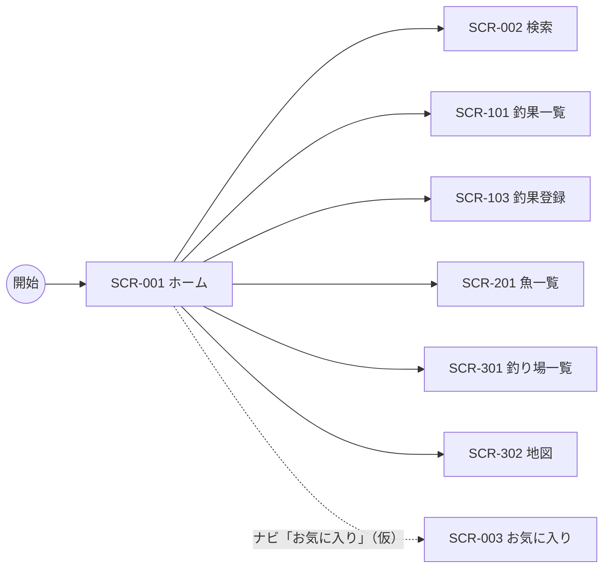

# SCR-001 ホーム画面

## 1. 基本情報
| 項目 | 内容 |
| --- | --- |
| 画面ID | SCR-001 |
| 画面名 | ホーム画面 |
| URL・パス | `/` |
| 概要（1行） | アプリのトップ。ユーザーが最初に開く入口で、グローバルナビから各機能へ遷移する |
| 対象ユーザー・権限 | 全ユーザー（権限による出し分けは保留 → [README.md](./README.md) の「権限の扱い」） |
| 関連画面 | SCR-002 検索画面 / SCR-003 お気に入り画面 / SCR-101 釣果一覧画面 / SCR-103 釣果登録画面 / SCR-201 魚一覧画面 / SCR-301 釣り場一覧画面 / SCR-302 地図画面 |
| ステータス | 下書き |
| デザインカンプ | [Figma: セリオ釣りMAP ＞ ホーム画面（node-id=1158-1649）](https://www.figma.com/design/LgJDTLLmkMfjeamo0zQl2b/%E3%82%BB%E3%83%AA%E3%82%AA%E9%87%A3%E3%82%8AMAP?node-id=1158-1649) |

## 2. 画面概要
ユーザーがアプリを開いたときに最初に表示される画面です。
画面左に常時表示されるグローバルナビ（Navigation Rail）を持ち、ここから各機能（地図・一覧・検索・お気に入り）へ遷移します。
メイン領域はウェルカムメッセージと「最近の釣果」セクションで構成され、釣果の登録へ進むボタンを備えます。
すべての画面への起点となるため、誰でも閲覧できます。

## 3. 画面レイアウト
**レイアウトの正典は Figma**。この設計書には対象フレームの URL を必ず記載する（「1. 基本情報＞デザインカンプ」と一致させる）。
見た目の詳細は Figma を参照し、ここでは URL とレスポンシブ方針・補足のみを扱う。

- **Figma フレーム URL**: https://www.figma.com/design/LgJDTLLmkMfjeamo0zQl2b/%E3%82%BB%E3%83%AA%E3%82%AA%E9%87%A3%E3%82%8AMAP?node-id=1158-1649
- **レスポンシブ方針（PC）**: 左に固定幅のサイドバー（Navigation Rail）、右に可変幅のメインコンテンツを置く2カラム構成。
- **レスポンシブ方針（SP）**: （記入）— Navigation Rail に「押すと広がる」と注記があり、ハンバーガー押下で展開する想定。狭幅時にドロワーになるかは要確認（「8. 備考・課題」参照）。

簡易ワイヤー（詳細は Figma が正典）:

```
+---+--------------------------------------+
| ≡ |  +--------------------------------+  |
|   |  | 釣りMAPへようこそ！            |  |
| ＋|  | 地図で釣り場を探したり、…      |  |
|   |  +--------------------------------+  |
| ● |                                      |
|map|  +--------------------------------+  |
|   |  | 最近の釣果                     |  |
| ○ |  | まだ釣果が登録されていません   |  |
|一覧|  | 釣果を登録して、…              |  |
|   |  +--------------------------------+  |
| ○ |                                      |
|検索|            [ 釣果を登録する ]        |
|   |                                      |
| ○ |                                      |
|お気|                                      |
+---+--------------------------------------+
  ↑ サイドバー（Navigation Rail）
    ● = 選択中（背景色付きの角丸で現在地を示す）
    ＋ = FAB（釣果登録）
```

> 画面項目（4.）・状態（6.）のテキストは Figma フレーム（node-id=1158-1649）から起こしています。

## 4. 画面項目
Figma フレームから読み取れる要素のみを記載しています。Figma 側がダミー値やテンプレート既定値のままの箇所は `（記入）` を残しています。

| No | 項目名 | 種別 | 必須 | 説明・制約（桁数 / 形式 / 初期値 など） |
| --- | --- | --- | --- | --- |
| 1 | メニュー開閉ボタン（ハンバーガー） | ボタン | − | Navigation Rail 上部に配置。共通コンポーネントに「押すと広がる」と注記あり。展開時の幅・表示内容は（記入） |
| 2 | 釣果登録ボタン（FAB） | ボタン | − | Navigation Rail 上部、ナビ項目とは別枠。全ユーザーに表示（保留: 会員のみ） |
| 3 | ナビ項目「map」 | リンク | − | アイコン＋ラベル。Figma では選択中（背景色付き）。ホーム画面なのに `map` が選択中である点は要確認（「8. 備考・課題」の課題2） |
| 4 | ナビ項目「一覧」 | リンク | − | アイコン＋ラベル。遷移先は要確認（課題1） |
| 5 | ナビ項目「検索」 | リンク | − | アイコン＋ラベル |
| 6 | ナビ項目「お気に入り」 | リンク | − | アイコン＋ラベル。遷移先は SCR-003。**機能自体が保留**（[docs/tasks.md](../tasks.md) の T-38） |
| 7 | ウェルカムメッセージ | ラベル | − | 「釣りMAPへようこそ！／地図で釣り場を探したり、釣果を記録・共有したり、／釣りをもっと楽しくするアプリです．」3行。末尾が全角ピリオド「．」である点は要確認（課題7） |
| 8 | ウェルカム画像 | 画像 | − | ウェルカムメッセージに添える画像（Figma 上は `image 7`）。内容は（記入） |
| 9 | 「最近の釣果」見出し | ラベル | ○ | 固定文言「最近の釣果」 |
| 10 | 最近の釣果リスト | 一覧（テーブル） | − | Figma は Empty 状態のみが描かれており、**データがある場合の表示が未作成**。表示件数・並び順・カード形式はすべて（記入）（課題4） |
| 11 | 釣果なしメッセージ | ラベル | − | 「まだ釣果が登録されていません／釣果を登録して、ここにひょうじしてみましょう！」。**Figma 側に誤字あり**（正: 表示）（課題6） |
| 12 | 「釣果を登録する」ボタン | ボタン | − | メイン領域下部。Figma 上は COMPONENT 化されている。押下時の遷移先は SCR-103 |

## 5. アクション / イベント
ホームからの遷移先は、Figma キャンバス上の矢印（`ホーム画面 --> …`）を根拠としています。ナビ項目と遷移先の対応づけは仮案です（「8. 備考・課題」の課題1参照）。

| 操作（トリガー） | 挙動（処理内容） | 遷移先・結果 |
| --- | --- | --- |
| ハンバーガー押下 | Navigation Rail を展開する（「押すと広がる」） | 同画面でサイドバーの表示状態が変わる |
| FAB（＋）押下 | 釣果の新規登録へ進む | SCR-103 釣果登録画面へ遷移。条件なし（保留: 会員のみ） |
| ナビ「map」押下 | 地図画面へ遷移 | SCR-302 地図画面へ遷移（Figma の矢印 `ホーム画面 --> map`） |
| ナビ「一覧」押下 | 一覧画面へ遷移 | SCR-101 釣果一覧画面へ遷移（仮）。Figma には釣果一覧・釣り場一覧・魚一覧の3本の矢印があり、どれがナビ「一覧」に対応するか要確認（課題1） |
| ナビ「検索」押下 | 検索画面へ遷移 | SCR-002 検索画面へ遷移（Figma の矢印 `ホーム画面 --> 検索`） |
| ナビ「お気に入り」押下 | お気に入り画面へ遷移 | SCR-003 お気に入り画面へ遷移。**機能自体が保留**（T-38） |
| 「釣果を登録する」ボタン押下 | 釣果の新規登録へ進む | SCR-103 釣果登録画面へ遷移（Figma の矢印 `ホーム画面 --> 入力フォーム`）。FAB との使い分けは要確認（課題5） |
| 最近の釣果のリスト項目押下 | 当該釣果の詳細へ進む | SCR-102 釣果詳細画面へ遷移（仮）— Figma がリスト未作成のため未確定（課題4） |

## 6. 表示・状態
表示条件と、状態ごとの見せ方を記入する。該当しない状態の行は削除してよい。

| 状態 | 表示条件 | 表示内容 |
| --- | --- | --- |
| 通常 | 画面表示時 | サイドバー（FAB、ナビ4項目）とメインコンテンツ（ウェルカムメッセージ、最近の釣果、釣果を登録するボタン）を表示する。現在表示中の画面に対応するナビ項目は、背景色付きの角丸（pill）でアイコンを囲んで現在地を示す |
| データ空（Empty） | 登録済みの釣果が 0 件 | 「最近の釣果」セクションに「まだ釣果が登録されていません／釣果を登録して、ここにひょうじしてみましょう！」を表示する（Figma はこの状態で描かれている） |
| ローディング | 最近の釣果の取得中 | （記入） |
| エラー | 取得・通信失敗 | （記入） |
| 権限なし | — | **保留**（ログイン機能を実装しないため当面は発生しない → [README.md](./README.md) の「権限の扱い」） |

## 7. 画面遷移
- **遷移元**: 開始（エントリーポイント。ユーザーが最初に開く画面）
- **遷移先**: SCR-002 検索画面 / SCR-003 お気に入り画面 / SCR-101 釣果一覧画面 / SCR-103 釣果登録画面 / SCR-201 魚一覧画面 / SCR-301 釣り場一覧画面 / SCR-302 地図画面

以下の実線は Figma キャンバス上の矢印を根拠としています。ナビ「お気に入り」からの遷移は Figma にフレームが無いため点線（仮説）で表記します。



全体の遷移は [screen-transition.md](./screen-transition.md) を参照してください。

## 8. 備考・課題
本設計書は当初ブラウザモック画像1枚から起こしたものですが、2026-08-31 に Figma フレーム（node-id=1158-1649）の内容を反映しました。以下は仕様確定時に解消してください。

1. **ナビ「一覧」の遷移先が未確定** — Figma キャンバスにはホーム画面から `釣果一覧` / `釣り場一覧` / `魚一覧表示` の3本の矢印があり、ナビ「一覧」がどれに対応するのか（あるいは3つとも別導線なのか）が読み取れません。「5. アクション / イベント」のマッピングは暫定です。
2. **ホーム画面なのにナビの選択中が `map`** — Figma 上のアクティブ表示がホームを指していません。ナビにホーム項目が無いのか、別画面の状態を流用したものか要確認。**（未解消のまま継続）**
3. ~~**メイン領域の入力欄がダミー**~~ — **解消**。ダミーの `Label` / `Value` 入力欄は Figma の `version1.0`（旧版）の内容でした。`version2.0` ではウェルカムメッセージ・最近の釣果・釣果登録ボタンで構成されており、[screen-list.md](./screen-list.md) の概要「最近の釣果や各機能への入口」と整合します。
4. **「最近の釣果」のデータあり時の表示が未作成** — Figma はデータ空（Empty）の状態のみが描かれています。表示件数・並び順・カード形式・リスト項目押下時の遷移先がすべて未確定です。
5. **釣果登録の導線が2つある** — サイドバーの FAB（＋）とメイン領域の「釣果を登録する」ボタンが、どちらも SCR-103 へ向かうと読めます。使い分け（常設の導線と Empty 時のみの導線か）を要確認。
6. **Figma 側の文言に誤字** — 釣果なしメッセージが「ここに**ひょうじ**してみましょう！」となっています（正: 表示）。Figma 側の修正が必要です。
7. **ウェルカムメッセージの句読点** — 末尾が全角ピリオド「．」で、他の文言（「！」）と体裁が揃っていません。表記ルールの確認が必要です。
8. ~~**アイコンがすべてプレースホルダ**~~ — 各ナビ項目の最終アイコンは Figma でも INSTANCE のままで、**未解消**。
9. ~~**Figma フレームの内容を未反映**~~ — **解消**。項目表（4.）・アクション（5.）・状態（6.）を Figma から起こしました。なお参照先のファイル名は「釣りMAP入力」ではなく **「セリオ釣りMAP」** でした（本設計書の記載も修正済み）。
10. **SP レイアウトが未定** — Navigation Rail の共通コンポーネントに「押すと広がる」と注記がありハンバーガーの挙動は判明しましたが、展開時の幅・狭幅時にドロワーへ切り替わるかは未確定です。
11. **古い Navigation Rail が Figma に残存** — 本フレームには Navigation Rail が2つ重なっており、片方は4項目目が `入力` で FAB が非表示（`version1.0` 相当の消し忘れ）です。**正は `map` / `一覧` / `検索` / `お気に入り` ＋ FAB** で、[SCR-302 地図画面](./SCR-302-map.md) の記述と一致します。Figma 側の整理が必要です。
12. **Material テンプレの残骸** — Navigation Rail の `Nav item 5` 〜 `7` が非表示のまま残っています（ラベルは `Label`）。

---

### 更新履歴
| 日付 | 版 | 変更内容 | 担当 |
| --- | --- | --- | --- |
| 2026-08-06 | 0.1 | 新規作成（モック画像から起こした骨子） | （記入） |
| 2026-08-06 | 0.2 | Figma フレーム URL を登録 | （記入） |
| 2026-08-13 | 0.3 | SCR-302 のモックとのナビ項目の食い違いを課題1に追記 | （記入） |
| 2026-08-31 | 0.4 | Figma フレーム（node-id=1158-1649）から項目表・アクション・状態を反映。ナビを `お気に入り`＋FAB に統一し、課題3・9 を解消。SCR-401 への遷移を削除（釣行は画面を持たないため） | （記入） |
| 2026-08-31 | 0.5 | Figma REST API（スキル `figma-sync`）で全フレームを再取得し、本設計書の記述と**差分なし**を確認 | （記入） |
