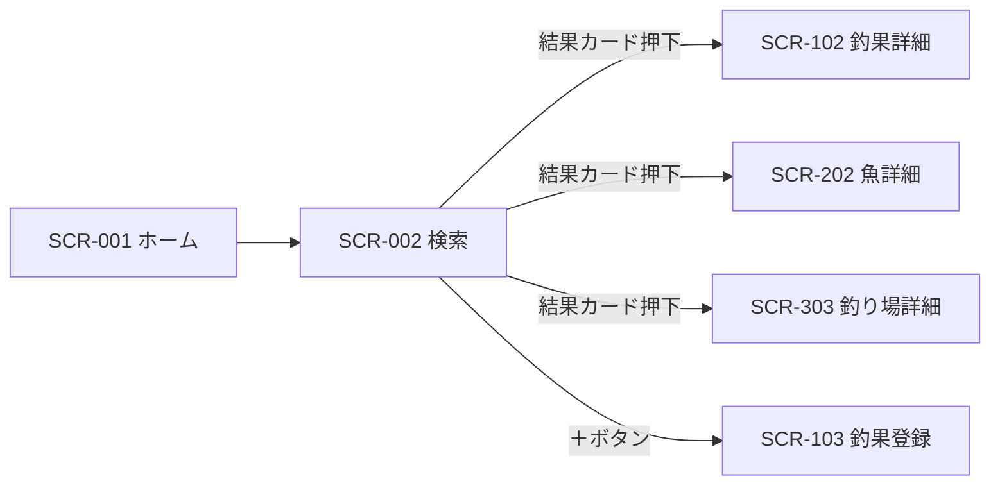

# SCR-002 検索画面

## 1. 基本情報
| 項目 | 内容 |
| --- | --- |
| 画面ID | SCR-002 |
| 画面名 | 検索画面 |
| URL・パス | `/search` |
| 概要（1行） | 釣果・魚・釣り場を横断的に検索し、カテゴリ別に結果を表示する |
| 対象ユーザー・権限 | 全ユーザー（権限による出し分けは保留 → [README.md](./README.md) の「権限の扱い」） |
| 関連画面 | SCR-001 ホーム画面 / SCR-003 お気に入り画面 / SCR-102 釣果詳細画面 / SCR-103 釣果登録画面 / SCR-202 魚詳細画面 / SCR-302 地図画面 / SCR-303 釣り場詳細画面 |
| ステータス | 下書き |
| デザインカンプ | [Figma: セリオ釣りMAP ＞ 検索（node-id=1158-2009）](https://www.figma.com/design/LgJDTLLmkMfjeamo0zQl2b/%E3%82%BB%E3%83%AA%E3%82%AA%E9%87%A3%E3%82%8AMAP?node-id=1158-2009) |

## 2. 画面概要
キーワードで釣果・魚・釣り場を横断的に検索する画面です。
グローバルナビの「検索」に対応します。
画面上部に検索バーと絞り込みチップを置き、その下にカテゴリ（魚・釣り場など）ごとの見出しで結果をグルーピングして表示します。
結果のカードから各詳細画面へ遷移します。

## 3. 画面レイアウト
**レイアウトの正典は Figma**。この設計書には対象フレームの URL を必ず記載する（「1. 基本情報＞デザインカンプ」と一致させる）。
見た目の詳細は Figma を参照し、ここでは URL とレスポンシブ方針・補足のみを扱う。

- **Figma フレーム URL**: https://www.figma.com/design/LgJDTLLmkMfjeamo0zQl2b/%E3%82%BB%E3%83%AA%E3%82%AA%E9%87%A3%E3%82%8AMAP?node-id=1158-2009
- **レスポンシブ方針（PC）**: 左に固定幅のサイドバー（Navigation Rail）、右に可変幅のメインコンテンツを置く2カラム構成。メインコンテンツは上から検索バー・絞り込みチップ・検索結果の縦積み。
- **レスポンシブ方針（SP）**: （記入）— Navigation Rail に「押すと広がる」と注記があり、ハンバーガー押下で展開する想定。狭幅時の絞り込みチップの扱いは要確認（「8. 備考・課題」参照）。

Figma のキャンバス上には、本フレームに向けて以下の注釈が置かれています（設計の意図として本設計書に反映済み）。

- 「最初は何も表示しない」
- 「①キーワード検索 ②フィルターチップ（よく使う条件） ③ソート」

簡易ワイヤー（詳細は Figma が正典）:

```
+---+--------------------------------------+
| ≡ | +----------------------------------+ |
|   | | Hinted search text             ◇ | |
| ＋| +----------------------------------+ |
|   | [Label][✓Label][Label][Label][Label] |
| ● |                                      |
|map| 検索結果：魚                         |
| ○ | +----------------------------------+ |
|一覧| | [画像] Title                     | |
| ○ | |        Updated yesterday         | |
|検索| +----------------------------------+ |
| ○ | 検索結果：釣り場                     |
|お気| +----------------------------------+ |
+---+--------------------------------------+
  ↑ サイドバー
    ● = 背景色付きの角丸（Figma では「map」に付いている。課題1参照）
    ◇ = アイコンボタン（プレースホルダのため用途未確定。課題12参照）
```

> 画面項目（4.）・状態（6.）のテキストは Figma フレーム（node-id=1158-2009）から起こしています。

## 4. 画面項目
モックから読み取れる要素のみを記載しています。モックがダミー値（`Hinted search text` / `Label` / `Title` / `Updated yesterday`）の箇所は `（記入）` を残しています。

| No | 項目名 | 種別 | 必須 | 説明・制約（桁数 / 形式 / 初期値 など） |
| --- | --- | --- | --- | --- |
| 1 | メニュー開閉ボタン（ハンバーガー） | ボタン | − | サイドバー上部に配置。押下時の挙動は要確認（サイドバーの折りたたみ／SP でのドロワー開閉） |
| 2 | 釣果登録ボタン（＋） | ボタン | − | サイドバー上部、ナビ項目とは別枠。背景色付きの角丸で強調表示。全ユーザーに表示（保留: 会員のみ） |
| 3 | ナビ項目「map」 | リンク | − | アイコン＋ラベル |
| 4 | ナビ項目「一覧」 | リンク | − | アイコン＋ラベル |
| 5 | ナビ項目「検索」 | リンク | − | アイコン＋ラベル。本画面が現在地 |
| 6 | ナビ項目「お気に入り」 | リンク | − | アイコン＋ラベル。遷移先は SCR-003 お気に入り画面。**機能自体が保留**（[docs/tasks.md](../tasks.md) の T-38） |
| 7 | 検索バー内メニューボタン | ボタン | − | Figma 上は Material 検索バーの `Leading-icon` で、**非表示に設定されています**。UI 上には出ない想定（課題2参照） |
| 8 | 検索キーワード入力欄 | テキスト入力 | − | Figma のプレースホルダは `Hinted search text`（ダミー）。実際の文言・桁数・入力可能文字は（記入）。初期値は空 |
| 9 | 検索バー右端アイコンボタン | ボタン | − | Figma 上は `1st trailing-icon`（`2nd trailing-icon` は非表示）。注釈の「③ソート」に対応する可能性があるが、アイコンがプレースホルダのため**用途は未確定**（課題12参照） |
| 10 | 絞り込みチップ（フィルターチップ） | チェックボックス | − | Figma では `Label` が5個で、2番目が選択中（チェックマーク＋背景色付き）。注釈より**「よく使う条件」を並べるもの**。具体的な選択肢の内容・個数・単一選択か複数選択かは（記入）（課題3参照） |
| 11 | 検索結果グループ見出し | ラベル | − | モックの表示は「検索結果：魚」「検索結果：釣り場」。カテゴリごとに結果を区切る。表示するカテゴリと並び順は（記入）（課題5参照） |
| 12 | 検索結果カード | その他 | − | グループ内に並ぶ結果1件分のカード。1グループあたりの表示件数・並び順・レイアウト（縦積みか横スクロールか）は（記入） |
| 13 | 結果サムネイル | 画像 | − | カード上部。モックはプレースホルダ画像。画像が無い場合の代替表示は（記入） |
| 14 | 結果タイトル | ラベル | ○ | モックの表示は `Title`（ダミー）。魚名・釣り場名などカテゴリごとに入る値は（記入）。桁数・省略表示の要否も（記入） |
| 15 | 結果サブテキスト | ラベル | − | モックの表示は `Updated yesterday`（ダミー・英語）。表示する内容（更新日時か、魚種・エリアなどの属性か）が未確定（課題6参照） |

> モック中の黒い太枠（「検索」ナビ項目を囲む枠）は注目箇所を示す注記であり、UI 上の罫線ではありません。

## 5. アクション / イベント
ナビの遷移先は、既存の画面一覧に当てはめた**仮案**です（「8. 備考・課題」の課題4参照）。

| 操作（トリガー） | 挙動（処理内容） | 遷移先・結果 |
| --- | --- | --- |
| ハンバーガー押下 | サイドバーの表示／非表示を切り替える（挙動は要確認） | 同画面でサイドバーの表示状態が変わる |
| 「＋」ボタン押下 | 釣果の新規登録へ進む | SCR-103 釣果登録画面へ遷移（仮）。条件なし（保留: 会員のみ） |
| ナビ「map」押下 | 地図画面へ遷移 | SCR-302 地図画面へ遷移（仮） |
| ナビ「一覧」押下 | 一覧画面へ遷移 | SCR-101 釣果一覧画面へ遷移（仮） |
| ナビ「お気に入り」押下 | お気に入り画面へ遷移 | SCR-003 お気に入り画面へ遷移。**機能自体が保留**（T-38） |
| 検索キーワード入力 | （記入：逐次検索を行うか、確定操作を待つか） | （記入） |
| 検索実行（虫眼鏡押下 / Enter） | 入力キーワードで検索し、結果をカテゴリ別に表示する | 同画面で検索結果が更新される |
| 絞り込みチップ押下 | 当該条件の選択・解除を切り替え、検索結果を絞り込む | 同画面でチップの選択状態と検索結果が更新される |
| 検索結果カード押下（魚） | 当該の魚の詳細へ進む | SCR-202 魚詳細画面へ遷移 |
| 検索結果カード押下（釣り場） | 当該の釣り場の詳細へ進む | SCR-303 釣り場詳細画面へ遷移 |
| 検索結果カード押下（釣果） | 当該の釣果の詳細へ進む | SCR-102 釣果詳細画面へ遷移。※釣果カテゴリの有無は課題5参照 |

## 6. 表示・状態
表示条件と、状態ごとの見せ方を記入する。該当しない状態の行は削除してよい。

| 状態 | 表示条件 | 表示内容 |
| --- | --- | --- |
| 通常（検索前） | 画面表示直後、キーワード未入力 | 検索バーと絞り込みチップのみを表示し、**検索結果は何も表示しない**（Figma の注釈「最初は何も表示しない」）。おすすめ・履歴なども出さない |
| 通常（検索後） | 検索結果が1件以上 | カテゴリごとに見出しと結果カードを表示する |
| ローディング | 検索結果の取得中 | （記入） |
| データ空（Empty） | 該当データ 0 件 | （記入）— カテゴリ見出しごと非表示にするのか、「該当なし」と出すのか要確認 |
| エラー | 取得・通信失敗 | （記入） |

## 7. 画面遷移
- **遷移元**: SCR-001 ホーム画面（グローバルナビ「検索」）／全画面のグローバルナビ
- **遷移先**: SCR-102 釣果詳細画面 / SCR-202 魚詳細画面 / SCR-303 釣り場詳細画面 / SCR-103 釣果登録画面（＋ボタン、仮）



全体の遷移は [screen-transition.md](./screen-transition.md) を参照してください。

## 8. 備考・課題
本設計書はブラウザモック画像1枚から起こしたもので、検索バー・チップ・結果カードの中身がダミー値のため未確定の箇所が多く残っています。以下は仕様確定時に解消してください。

1. **ナビの選択中表示が「検索」ではなく「map」になっている** — 本画面は検索画面ですが、背景色付きの角丸（現在地表示）が `map` に付いたままです。[SCR-001](./SCR-001-home.md)・[SCR-302](./SCR-302-map.md) のモックでも同様に `map` が選択中で、モック側で現在地表示を更新していないだけと推測されます。現在地表示の仕様（どの画面でどの項目が選択中になるか）を確定させる必要があります。
2. ~~**ハンバーガーアイコンが2箇所にある**~~ — **解消**。検索バー左端のアイコン（`Leading-icon`）は Figma 上で**非表示に設定されており**、UI には出ません。サイドバーのハンバーガーのみが有効です。
3. **絞り込みチップの中身が未定** — Figma は `Label` が5個で、2番目が選択中です。注釈から**「よく使う条件」を並べるもの**とは判明しましたが、具体的な選択肢（魚種／エリア／期間など）、単一選択か複数選択か、既定でどれが選ばれているかは未定です。
4. ~~**ナビ項目と画面一覧の対応が暫定・「お気に入り」が未定義**~~ — 「お気に入り」は **SCR-003 として採番済み**（解消）。ただし `一覧`→SCR-101 釣果一覧、`map`→SCR-302 地図、`FAB`→SCR-103 釣果登録 のマッピングは仮案のままです。
5. **検索結果のカテゴリの並びが未定** — Figma フレーム上の見出しは「検索結果：魚」「検索結果：釣り場」の2つですが、キャンバスの矢印は `検索 --> 魚詳細` / `検索 --> map詳細` / `検索 --> 釣果詳細` の3本あり、**釣果カテゴリも存在する**ことが確認できました。フレーム側に釣果の見出しが未作成です。カテゴリの並び順もあわせて要確認。
6. **結果カードのサブテキストが未定** — モックは `Updated yesterday`（英語のダミー）です。日本語での表示文言と、そもそも何を表示するか（更新日時か、魚種・エリアなどの属性か）を確定させる必要があります。カテゴリごとに表示内容を変えるかも要確認。
7. **検索結果の件数制御が未定** — 1カテゴリあたり何件表示するか、続きを見る導線（「もっと見る」／ページング／無限スクロール）があるか、全体の並び順（関連度／新着順）が不明です。
8. **検索キーワードの URL 反映が未定** — 検索条件を `/search?q=...` のようにクエリパラメータへ持たせ、リロード・共有・ブラウザバックで復元できるようにするか要確認。
9. **アイコンがすべてプレースホルダ** — 各ナビ項目の最終アイコンが未定。
10. ~~**Figma フレーム URL が未提供**~~ — **解消**。「1. 基本情報」「3. 画面レイアウト」の両方に反映しました。
11. **SP レイアウトが未定** — Navigation Rail の共通コンポーネントに「押すと広がる」と注記がありハンバーガーの挙動は判明しましたが、狭幅時の絞り込みチップの折り返し・横スクロールの扱いは未確定です。
12. **ソート UI が未作成** — Figma の注釈は「①キーワード検索 ②フィルターチップ ③ソート」の3点構成ですが、フレーム上にソートに相当する UI が見当たりません。検索バー右端のアイコンボタンがそれに当たるのか、別途追加するのか要確認。
13. **Material テンプレの残骸** — 結果カードの `Title` / `Updated yesterday`、Navigation Rail の `Nav item 5` 〜 `7`（非表示）が残っています。

---

### 更新履歴
| 日付 | 版 | 変更内容 | 担当 |
| --- | --- | --- | --- |
| 2026-08-14 | 0.1 | 新規作成（モック画像から起こした骨子） | （記入） |
| 2026-08-31 | 0.2 | Figma フレーム（node-id=1158-2009）とキャンバス注釈を反映。課題2・4・10 を解消し、検索前の表示・フィルターチップの位置づけを確定。ソート UI 未作成を課題12 に追加 | （記入） |
| 2026-08-31 | 0.3 | Figma REST API（スキル `figma-sync`）で全フレームを再取得し、本設計書の記述と**差分なし**を確認。「3. 画面レイアウト」の Figma 取得に関する注記を [README.md](./README.md) の記述に合わせた | （記入） |
