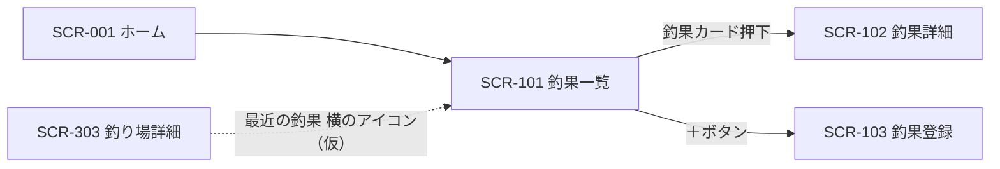

# SCR-101 釣果一覧画面

## 1. 基本情報
| 項目 | 内容 |
| --- | --- |
| 画面ID | SCR-101 |
| 画面名 | 釣果一覧画面 |
| URL・パス | `/catches` |
| 概要（1行） | 投稿された釣果をカードのグリッドで一覧表示する |
| 対象ユーザー・権限 | 全ユーザー（権限による出し分けは保留 → [README.md](./README.md) の「権限の扱い」） |
| 関連画面 | SCR-001 ホーム画面 / SCR-002 検索画面 / SCR-003 お気に入り画面 / SCR-102 釣果詳細画面 / SCR-103 釣果登録画面 / SCR-201 魚一覧画面 / SCR-301 釣り場一覧画面 / SCR-302 地図画面 / SCR-303 釣り場詳細画面 |
| ステータス | 下書き |
| デザインカンプ | [Figma: セリオ釣りMAP ＞ 釣果一覧（node-id=1159-2799）](https://www.figma.com/design/LgJDTLLmkMfjeamo0zQl2b/%E3%82%BB%E3%83%AA%E3%82%AA%E9%87%A3%E3%82%8AMAP?node-id=1159-2799) |

> **Figma のフレーム名は「釣果一覧」ですが、フレーム内の画面タイトルは「宇野港で釣れる魚」です。**釣果ではなく「釣り場で絞り込んだ魚の一覧」と読める文言のため、本画面が何の一覧なのかが未確定です（課題1参照）。本設計書は [screen-list.md](./screen-list.md) の採番に従い「釣果一覧」として起こしています。

## 2. 画面概要
投稿された釣果をカードのグリッドで一覧表示する画面です。
画面上部に Top app bar（戻る・タイトル・アクションアイコン3つ）と絞り込みチップを置き、その下にカードを格子状に並べます。
カードから釣果詳細画面へ遷移します。
Figma 上のタイトルが「宇野港で釣れる魚」となっており、釣り場で絞り込んだ状態として描かれています（課題1・課題2参照）。

## 3. 画面レイアウト
**レイアウトの正典は Figma**。この設計書には対象フレームの URL を必ず記載する（「1. 基本情報＞デザインカンプ」と一致させる）。
見た目の詳細は Figma を参照し、ここでは URL とレスポンシブ方針・補足のみを扱う。

- **Figma フレーム URL**: https://www.figma.com/design/LgJDTLLmkMfjeamo0zQl2b/%E3%82%BB%E3%83%AA%E3%82%AA%E9%87%A3%E3%82%8AMAP?node-id=1159-2799
- **レスポンシブ方針（PC）**: 左に固定幅のサイドバー（Navigation Rail）、右に可変幅のメインコンテンツを置く2カラム構成。メインコンテンツは上から Top app bar（戻る・タイトル・アクションアイコン）・絞り込みチップ・カードグリッドの縦積み。Figma のグリッドは5列・**カード22枚**。
- **レスポンシブ方針（SP）**: （記入）— Navigation Rail に「押すと広がる」と注記があり、ハンバーガー押下で展開する想定。グリッドの列数の切り替え基準は未定（課題7参照）。

> レイアウト構成は [SCR-201 魚一覧画面](./SCR-201-fish-list.md)・[SCR-301 釣り場一覧画面](./SCR-301-spot-list.md) と**完全に同一**です（Figma のレイヤー構造・カード枚数まで一致）。差分は画面タイトルのみで、共通コンポーネント化の要否は課題3を参照してください。

簡易ワイヤー（詳細は Figma が正典）:

```
+---+--------------------------------------+
| ≡ | ←                      ◇   ◇   ◇    |
|   | 宇野港で釣れる魚                     |
| ＋| +----------------------------------+ |
|   | |[Label][✓Label][Label][Label][…] | |
| ● | |                                  | |
|map| | [画像] [画像] [画像] [画像] [画像]| |
| ○ | |  Title  Title  Title  Title  Title| |
|一覧| |  Upd... Upd... Upd... Upd... Upd..| |
| ○ | | [画像] [画像] [画像] [画像] [画像]| |
|検索| |  Title  Title  Title  Title  Title| |
| ○ | | （全22枚。以下スクロール）       | |
|お気| +----------------------------------+ |
+---+--------------------------------------+
  ↑ サイドバー
    ● = 背景色付きの角丸（Figma では「map」に付いている。課題4参照）
    ◇ = ヘッダーアクション（プレースホルダのため用途未確定。課題6参照）
```

> 画面項目（4.）・状態（6.）のテキストは Figma フレーム（node-id=1159-2799）から起こしています。

## 4. 画面項目
Figma フレームから読み取れる要素のみを記載しています。Figma 側がダミー値（`Label` / `Title` / `Updated today` など）のままの箇所は `（記入）` を残しています。

| No | 項目名 | 種別 | 必須 | 説明・制約（桁数 / 形式 / 初期値 など） |
| --- | --- | --- | --- | --- |
| 1 | メニュー開閉ボタン（ハンバーガー） | ボタン | − | サイドバー上部に配置。共通コンポーネントに「押すと広がる」と注記あり。展開時の幅・表示内容は（記入） |
| 2 | 釣果登録ボタン（＋） | ボタン | − | サイドバー上部、ナビ項目とは別枠。全ユーザーに表示（保留: 会員のみ） |
| 3 | ナビ項目「map」 | リンク | − | アイコン＋ラベル |
| 4 | ナビ項目「一覧」 | リンク | − | アイコン＋ラベル。本画面が現在地かどうかは未確定（課題1参照） |
| 5 | ナビ項目「検索」 | リンク | − | アイコン＋ラベル |
| 6 | ナビ項目「お気に入り」 | リンク | − | アイコン＋ラベル。遷移先は SCR-003 お気に入り画面。**機能自体が保留**（[docs/tasks.md](../tasks.md) の T-38） |
| 7 | 戻るボタン（←） | ボタン | − | Top app bar 左端（`leading-icon`）。遷移元へ戻る。グローバルナビから直接開いた場合の戻り先は（記入）（課題5参照） |
| 8 | 画面タイトル | ラベル | ○ | Figma の表示は「宇野港で釣れる魚」。絞り込み条件を反映した動的な文言と推測（課題2参照）。桁数・省略表示の要否は（記入） |
| 9 | ヘッダーアクション1 | ボタン | − | Top app bar 右（`trailing-icon 1`）。アイコンがプレースホルダで**用途が不明**（課題6参照） |
| 10 | ヘッダーアクション2 | ボタン | − | Top app bar 右（`trailing-icon 2`）。同上（課題6参照） |
| 11 | ヘッダーアクション3 | ボタン | − | Top app bar 右端（`trailing-icon 3`）。同上（課題6参照） |
| 12 | 絞り込みチップ | チェックボックス | − | Figma では `Label` が5個。選択中はチェックマーク（✓）＋背景色付きで表示。選択肢の内容・個数・単一選択か複数選択かがすべて（記入）。釣果に対する絞り込み軸（魚種／釣り場／期間など）が不明（課題8参照） |
| 13 | 釣果カード | その他 | − | グリッドの1マス。Figma は5列・22枚。カード全体が釣果詳細へのリンク |
| 14 | 釣果のサムネイル | 画像 | − | カード上部（`Image`）。Figma 上はすべてプレースホルダ。画像が無い場合の代替表示は（記入） |
| 15 | 釣果のタイトル | ラベル | ○ | Figma の表示は `Title`（ダミー）。魚種名か、釣果自体のタイトルかは（記入）（課題9参照） |
| 16 | サブテキスト | ラベル | − | Figma の表示は `Updated today` / `Updated yesterday` / `Updated 2 days ago`（ダミー・英語）。表示内容（釣れた日時か、釣り場・サイズなどの属性か）は（記入）（課題10参照） |

## 5. アクション / イベント
ナビの遷移先は、既存の画面一覧に当てはめた**仮案**です（「8. 備考・課題」の課題4参照）。

| 操作（トリガー） | 挙動（処理内容） | 遷移先・結果 |
| --- | --- | --- |
| ハンバーガー押下 | Navigation Rail を展開する（「押すと広がる」） | 同画面でサイドバーの表示状態が変わる |
| 「＋」ボタン押下 | 釣果の新規登録へ進む | SCR-103 釣果登録画面へ遷移（仮）。条件なし（保留: 会員のみ） |
| ナビ「map」押下 | 地図画面へ遷移 | SCR-302 地図画面へ遷移（仮） |
| ナビ「一覧」押下 | 一覧画面へ遷移 | SCR-201 魚一覧画面へ遷移（仮。課題4参照） |
| ナビ「検索」押下 | 検索画面へ遷移 | SCR-002 検索画面へ遷移（仮） |
| ナビ「お気に入り」押下 | お気に入り画面へ遷移 | SCR-003 お気に入り画面へ遷移。**機能自体が保留**（T-38） |
| 戻るボタン（←）押下 | 直前の画面へ戻る | （記入：遷移元による。課題5参照） |
| ヘッダーアクション1 押下 | （記入：用途不明） | （記入） |
| ヘッダーアクション2 押下 | （記入：用途不明） | （記入） |
| ヘッダーアクション3 押下 | （記入：用途不明） | （記入） |
| 絞り込みチップ押下 | 当該条件の選択・解除を切り替え、一覧を絞り込む | 同画面でチップの選択状態と一覧が更新される。画面タイトルも連動するかは（記入）（課題2参照） |
| 釣果カード押下 | 当該の釣果の詳細へ進む | SCR-102 釣果詳細画面へ遷移（Figma の矢印 `釣果一覧 --> 釣果詳細`） |
| 一覧末尾までスクロール | （記入：追加読み込みかページングか） | （記入）（課題11参照） |

## 6. 表示・状態
表示条件と、状態ごとの見せ方を記入する。該当しない状態の行は削除してよい。

| 状態 | 表示条件 | 表示内容 |
| --- | --- | --- |
| 通常 | 該当する釣果が1件以上 | 絞り込みチップと釣果カードのグリッドを表示する。Figma は5列 |
| ローディング | 一覧データの取得中 | （記入） |
| データ空（Empty） | 該当データ 0 件 | （記入）— 絞り込みで0件になった場合の案内文・条件解除の導線を含めて要確認。[SCR-001 ホーム画面](./SCR-001-home.md) には Empty 時の文言があるが、本画面には Figma 上に該当する表示がない |
| エラー | 取得・通信失敗 | （記入） |
| 権限なし | — | **保留**（ログイン機能を実装しないため当面は発生しない → [README.md](./README.md) の「権限の扱い」） |

## 7. 画面遷移
- **遷移元**: SCR-001 ホーム画面（Figma の矢印 `ホーム画面 --> 釣果一覧`）/ SCR-303 釣り場詳細画面（「最近の釣果」見出し横のアイコン、仮）/ 全画面のグローバルナビ「一覧」（仮）
- **遷移先**: SCR-102 釣果詳細画面 / SCR-103 釣果登録画面（＋ボタン、仮）



全体の遷移は [screen-transition.md](./screen-transition.md) を参照してください。

## 8. 備考・課題
本設計書は 2026-08-31 に Figma フレーム（node-id=1159-2799）から新規に起こしたものです。カードの中身がダミー値のため未確定の箇所が多く残っています。以下は仕様確定時に解消してください。

1. **フレーム名と画面タイトルが食い違っている** — Figma のフレーム名は「釣果一覧」ですが、フレーム内の画面タイトルは**「宇野港で釣れる魚」**です。文言どおりなら「釣り場で絞り込んだ**魚**の一覧」であり、釣果の一覧ではありません。(a) タイトルの文言が誤り（釣果一覧が正）なのか、(b) この画面が実は釣り場で絞り込んだ魚一覧（[SCR-201](./SCR-201-fish-list.md) の条件付き表示）なのかを確定させる必要があります。**本設計書は (a) の前提で起こしています。** (b) が正の場合、[screen-list.md](./screen-list.md) の SCR-101 の割り当てから見直しが必要です。
2. **画面タイトルが条件付きになっている** — [screen-list.md](./screen-list.md) の概要は「投稿された釣果の一覧」ですが、Figma は釣り場（宇野港）で絞り込んだ状態です。(a) 条件なしの素の一覧と同一画面なのか別画面なのか、(b) タイトルが絞り込み条件に応じて動的に変わるのか、(c) URL に条件を持たせるか（`/catches?spot=...`）が要確認です。[SCR-301](./SCR-301-spot-list.md) 課題2と同一の論点です。
3. **[SCR-201 魚一覧画面](./SCR-201-fish-list.md)・[SCR-301 釣り場一覧画面](./SCR-301-spot-list.md) とレイアウトが完全に同一** — Figma のレイヤー構造を比較したところ、Top app bar（戻る・タイトル・アクション3つ）、絞り込みチップ5個、5列・22枚のカードグリッドまで**一字一句同じ構成**でした。差分は画面タイトルのみです。3画面を共通の一覧テンプレートとして定義し、各画面では差分（タイトル・カードの中身・絞り込み軸）のみ記述する方針にするか要確認。3画面の課題も大半が共通しています。
4. **ナビの選択中表示が「map」になっている** — 背景色付きの角丸が `map` に付いたままです。[SCR-001](./SCR-001-home.md)・[SCR-002](./SCR-002-search.md)・[SCR-201](./SCR-201-fish-list.md)・[SCR-301](./SCR-301-spot-list.md)・[SCR-302](./SCR-302-map.md)・[SCR-303](./SCR-303-spot-detail.md) でも同様です。本画面がナビ「一覧」に対応するのかも未確定で、[SCR-201](./SCR-201-fish-list.md) 課題1・課題3と一体で確定させる必要があります。
5. **戻るボタン（←）の戻り先が未定** — グローバルナビから直接開いた場合、戻る先がありません。ナビ経由では非表示にするのか、常に表示してホームへ戻すのか要確認（[SCR-201](./SCR-201-fish-list.md) 課題5・[SCR-301](./SCR-301-spot-list.md) 課題4と同一）。
6. **ヘッダーアクション3つの用途が不明** — Figma 上は Material の Top app bar の `trailing-icon 1` 〜 `3` がそのまま残っており、アイコンも差し替えられていません。残すなら用途の定義が、不要なら削除が必要です（[SCR-201](./SCR-201-fish-list.md) 課題6・[SCR-301](./SCR-301-spot-list.md) 課題5と同一）。
7. **グリッドの列数のレスポンシブ方針が未定** — Figma は5列ですが、幅に応じて何列まで減らすかの基準が不明です。
8. **絞り込みチップの中身が未定** — Figma は `Label` が5個で2番目が選択中です。釣果をどの軸で絞り込むのか（魚種／釣り場／期間／サイズなど）、単一選択か複数選択か、既定でどれが選ばれているかが不明です。[SCR-002](./SCR-002-search.md)・[SCR-201](./SCR-201-fish-list.md)・[SCR-301](./SCR-301-spot-list.md) と同一の見た目のため、画面ごとに選択肢を変えるのか共通化するのかも要確認。
9. **カードのタイトルが何を指すか未定** — Figma は `Title`（ダミー）です。釣果のカードに出すのが魚種名なのか、釣果自体のタイトル（投稿者が付ける名前）なのかが読み取れません。[SCR-303](./SCR-303-spot-detail.md) 課題9と同一の論点です。
10. **サブテキストの表示内容が未定** — Figma は `Updated today` などの英語ダミーです。釣果一覧で「更新日」を出すのが妥当か（釣れた日時・釣り場・サイズなどの方が有用ではないか）を含め、表示内容そのものの再検討と日本語での文言確定が必要です。
11. **一覧の件数制御が未定** — Figma はカード22枚を並べていますが、これが初期表示件数を意味するのかは不明です。続きを見る導線（「もっと見る」／ページング／無限スクロール）、並び順（新着順／人気順）も未確定です。
12. **カードにお気に入りの導線が無い** — カードは `Image` ＋ `Title` ＋ `Date` のみです（お気に入り機能自体は T-38 で保留）。
13. **アイコンがすべてプレースホルダ** — 各ナビ項目の最終アイコンが未定。
14. **Material テンプレの残骸** — カードの `Title` / `Updated today` 等、Top app bar の `trailing-icon 1`〜`3`、Navigation Rail の `Nav item 5`〜`7`（非表示）が残っています。またカードグリッドの上に別レイヤーの画像（`image 4`）が重なっており、1枚目のカードを覆っています（[SCR-201](./SCR-201-fish-list.md) 課題9・[SCR-301](./SCR-301-spot-list.md) 課題8と同一）。

---

### 更新履歴
| 日付 | 版 | 変更内容 | 担当 |
| --- | --- | --- | --- |
| 2026-08-31 | 0.1 | 新規作成。Figma フレーム（node-id=1159-2799）から項目表・アクション・状態を起こした | （記入） |
