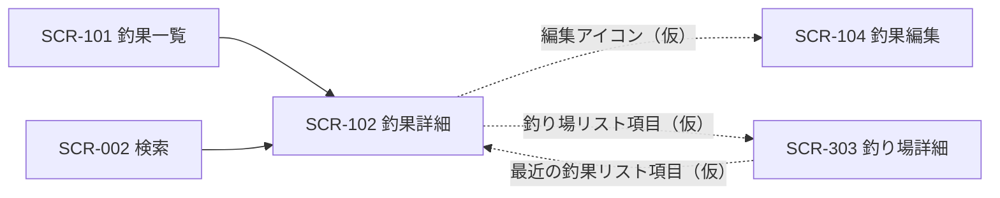

# SCR-102 釣果詳細画面

## 1. 基本情報
| 項目 | 内容 |
| --- | --- |
| 画面ID | SCR-102 |
| 画面名 | 釣果詳細画面 |
| URL・パス | `/catches/:id` |
| 概要（1行） | 釣果1件の詳細（写真・魚種・釣れた匹数・天気・最大サイズなど）を表示する |
| 対象ユーザー・権限 | 全ユーザー（権限による出し分けは保留 → [README.md](./README.md) の「権限の扱い」） |
| 関連画面 | SCR-002 検索画面 / SCR-003 お気に入り画面 / SCR-101 釣果一覧画面 / SCR-103 釣果登録画面 / SCR-104 釣果編集画面 / SCR-202 魚詳細画面 / SCR-301 釣り場一覧画面 / SCR-302 地図画面 / SCR-303 釣り場詳細画面 |
| ステータス | 下書き |
| デザインカンプ | [Figma: セリオ釣りMAP ＞ 釣果詳細（node-id=1161-2372）](https://www.figma.com/design/LgJDTLLmkMfjeamo0zQl2b/%E3%82%BB%E3%83%AA%E3%82%AA%E9%87%A3%E3%82%8AMAP?node-id=1161-2372) |

> **本フレームはメインコンテンツ（`Content`）が2つ重なっており、中身が異なります。**片方は [SCR-303 釣り場詳細画面](./SCR-303-spot-detail.md)（`map詳細`）の複製、もう片方は [SCR-202 魚詳細画面](./SCR-202-fish-detail.md) の複製に手を入れたものです。本設計書は**後者を本画面の設計として採用**し、前者は消し忘れとして扱っています（課題1参照）。

## 2. 画面概要
釣果1件の詳細を表示する画面です。
上部に写真と釣果の属性（魚種・釣れた匹数・天気・最大サイズ）・説明文・「釣果登録」ボタンを置き、下部に「直近の釣り場」としてリストを並べます。
一覧・検索・釣り場詳細・魚詳細のいずれからも到達する、釣果情報の集約先です。
Figma 上は [SCR-202 魚詳細画面](./SCR-202-fish-detail.md) の複製に属性テキストを差し替えただけの状態で、釣果固有の作り込みは未了です（課題2参照）。

## 3. 画面レイアウト
**レイアウトの正典は Figma**。この設計書には対象フレームの URL を必ず記載する（「1. 基本情報＞デザインカンプ」と一致させる）。
見た目の詳細は Figma を参照し、ここでは URL とレスポンシブ方針・補足のみを扱う。

- **Figma フレーム URL**: https://www.figma.com/design/LgJDTLLmkMfjeamo0zQl2b/%E3%82%BB%E3%83%AA%E3%82%AA%E9%87%A3%E3%82%8AMAP?node-id=1161-2372
- **レスポンシブ方針（PC）**: 左に固定幅のサイドバー（Navigation Rail）、右に可変幅のメインコンテンツを置く2カラム構成。メインコンテンツは上から Top app bar（戻るリンク・アクションアイコン2つ）、釣果情報ブロック（左に写真、右に属性・説明・釣果登録ボタンの横並び2カラム）、「直近の釣り場」セクション（縦積みのリスト3件）。
- **レスポンシブ方針（SP）**: （記入）— 釣果情報ブロックを写真の上下積みに切り替える想定だが、Figma に情報がないため要確認。

簡易ワイヤー（詳細は Figma が正典）:

```
+---+--------------------------------------+
| ≡ | ← 魚一覧に戻る           ◇    ◇     |
|   | +----------+  ［見出しなし］[編集]   |
| ＋| |          |  魚種、釣れた匹、天気、 |
|   | |  写真    |  最大サイズ             |
| ● | |          |  （説明文：2段落）      |
|map| +----------+  [ 釣果登録 ]           |
| ○ |                                      |
|一覧| 直近の釣り場 ◇ ⇅                    |
| ○ | +----------------------------------+ |
|検索| |[写真] 宇野                        | |
| ○ | |       Description ...             | |
|お気| | ◇ Today・23 min              ◇  | |
|   | +----------------------------------+ |
|   | |[   ]  Title  （全3件）           | |
+---+--------------------------------------+
  ↑ サイドバー
    ● = 背景色付きの角丸（Figma では「map」に付いている。課題4参照）
    ◇ = アイコン（Figma 上はプレースホルダのため用途未確定）
    ⇅ = Sliders（並べ替え・絞り込みと推測されるが根拠なし。課題9参照）
```

> 画面項目（4.）・状態（6.）のテキストは Figma フレーム（node-id=1161-2372）から起こしています。

## 4. 画面項目
Figma フレームから読み取れる要素のみを記載しています。Figma 側がダミー値（`Lorem ipsum ...` / `Description ...` / `Today・23 min` / `Title`）のままの箇所は `（記入）` を残しています。

| No | 項目名 | 種別 | 必須 | 説明・制約（桁数 / 形式 / 初期値 など） |
| --- | --- | --- | --- | --- |
| 1 | メニュー開閉ボタン（ハンバーガー） | ボタン | − | サイドバー上部に配置。共通コンポーネントに「押すと広がる」と注記あり |
| 2 | 釣果登録ボタン（＋、サイドバー） | ボタン | − | サイドバー上部、ナビ項目とは別枠。本文中の「釣果登録」ボタン（No.9）と導線が重複（課題5参照） |
| 3 | ナビ項目「map」/「一覧」/「検索」/「お気に入り」 | リンク | − | アイコン＋ラベルの4項目。本画面はナビ直結ではないため、いずれも現在地にはならない想定（課題4参照） |
| 4 | 戻るリンク（← ＋ 文言） | リンク | − | Top app bar 左。Figma の表示は**「魚一覧に戻る」**。釣果詳細の戻り先として妥当か要確認（課題3参照） |
| 5 | ヘッダーアクション1 | ボタン | − | Top app bar 右（`trailing-icon 1`）。アイコンがプレースホルダで**用途が不明**（課題6参照） |
| 6 | ヘッダーアクション2 | ボタン | − | Top app bar 右端（`trailing-icon 3`。`trailing-icon 2` は非表示）。同上（課題6参照） |
| 7 | 釣果写真 | 画像 | − | 釣果情報ブロック左側（`Header > Image`）。Figma 上は画像レイヤーが2枚（`image 1` / `image 4`）重なっている。複数枚を扱うか、画像が無い場合の代替表示は（記入）（課題7参照） |
| 8 | 釣果の属性表示 | ラベル | − | Figma の表示は**「魚種、釣れた匹、天気、最大サイズ」**。項目名を並べただけのテキスト1行で、各値の表示形式・並び・区切りは（記入）。レイヤー名はテンプレ既定の `Published date` のまま（課題2参照） |
| 9 | 編集アイコン | ボタン | − | 属性表示の上（Figma 上は `edit` という**中身が空のフレーム**）。SCR-104 釣果編集画面への導線と推測されるが、Figma に根拠なし（課題8参照） |
| 10 | 釣果の説明文 | ラベル | − | Figma は Lorem ipsum の2段落。文字数上限・段落数・改行の扱い・折りたたみの要否は（記入） |
| 11 | 「釣果登録」ボタン | ボタン | − | 塗りボタン（`Header > Text column > Button`）。**詳細画面に新規登録のボタンがある理由が不明**（課題5参照）。条件なし（保留: 会員のみ） |
| 12 | 「直近の釣り場」セクション見出し | ラベル | − | Figma の表示は「直近の釣り場」。**釣果1件の詳細に「直近の釣り場」リストが並ぶ理由が不明**（課題2参照） |
| 13 | セクション見出し横のアイコンボタン | ボタン | − | 見出し右（`Title header > Icon button`）。アイコンがプレースホルダで**用途が不明**（課題9参照） |
| 14 | セクション見出し横の Sliders | ボタン | − | 見出し右（`Title header > Sliders`）。並べ替え・絞り込みと推測されるが Figma に根拠なし（課題9参照） |
| 15 | 釣り場リスト項目 | その他 | − | 「直近の釣り場」内の1件分（`column 01 > List item 01` 〜 `03`）。Figma は3件。表示件数・並び順は（記入） |
| 16 | 釣り場のサムネイル | 画像 | − | リスト項目左側。画像が無い場合の代替表示は（記入） |
| 17 | 釣り場名 | ラベル | ○ | Figma の表示は1件目のみ「宇野」、2・3件目は `Title`（ダミー）。[SCR-303](./SCR-303-spot-detail.md) の「宇野港」と表記が揃っていない（課題10参照） |
| 18 | 釣り場の説明文 | ラベル | − | Figma の表示は `Description duis aute ...`（ダミー・英語）。表示内容・行数制限は（記入） |
| 19 | リスト項目のメタ情報 | ラベル | − | Figma の表示は `Today`（Date）＋ `•`（Separator）＋ `23 min`（Time）。**「23 min」が何を指すか不明**（課題11参照） |
| 20 | リスト項目のアイコン（左） | ボタン | − | メタ情報の左（`Leading & Trailing icons > Leading > Icon`）。**用途が不明**（課題11参照） |
| 21 | リスト項目のアイコン（右） | ボタン | − | リスト項目右端（同 `Icon`）。**用途が不明**（課題11参照） |

## 5. アクション / イベント

| 操作（トリガー） | 挙動（処理内容） | 遷移先・結果 |
| --- | --- | --- |
| ハンバーガー押下 | Navigation Rail を展開する（「押すと広がる」） | 同画面でサイドバーの表示状態が変わる |
| サイドバー「＋」押下 | 釣果の新規登録へ進む | SCR-103 釣果登録画面へ遷移（仮）。条件なし（保留: 会員のみ） |
| ナビ「map」/「一覧」/「検索」押下 | 各画面へ遷移 | SCR-302 地図画面 / SCR-201 魚一覧画面 / SCR-002 検索画面へ遷移（仮） |
| ナビ「お気に入り」押下 | お気に入り画面へ遷移 | SCR-003 お気に入り画面へ遷移。**機能自体が保留**（T-38） |
| 戻るリンク押下 | 遷移元の画面へ戻る | Figma の文言は「魚一覧に戻る」＝ SCR-201 魚一覧画面。遷移元に応じて変えるかは（記入）（課題3参照） |
| ヘッダーアクション1 押下 | （記入：用途不明） | （記入） |
| ヘッダーアクション2 押下 | （記入：用途不明） | （記入） |
| 編集アイコン押下 | （記入：釣果の編集と推測） | （記入：SCR-104 釣果編集画面へ遷移と推測。課題8参照） |
| 「釣果登録」ボタン押下 | （記入：新規登録なのか、この釣果に追記するのかが不明） | （記入：SCR-103 釣果登録画面へ遷移と推測。課題5参照） |
| セクション見出し横のアイコンボタン押下 | （記入：用途不明） | （記入）（課題9参照） |
| Sliders 押下 | （記入：並べ替え・絞り込みと推測） | （記入）（課題9参照） |
| 釣り場リスト項目押下 | 当該の釣り場の詳細へ進む | SCR-303 釣り場詳細画面へ遷移（仮） |
| リスト項目のアイコン（左 / 右）押下 | （記入：用途不明） | （記入） |

## 6. 表示・状態
表示条件と、状態ごとの見せ方を記入する。該当しない状態の行は削除してよい。

| 状態 | 表示条件 | 表示内容 |
| --- | --- | --- |
| 通常 | 当該釣果が存在する | 釣果情報ブロックと「直近の釣り場」リストを表示する |
| データ空（Empty） | 「直近の釣り場」が 0 件 | （記入）— セクションごと非表示にするのか、案内文を出すのか要確認 |
| ローディング | 釣果データの取得中 | （記入） |
| エラー | 取得・通信失敗 | （記入）— 存在しない `:id` を指定された場合の扱い（404 表示など）も要確認 |
| 権限なし | — | **保留**（ログイン機能を実装しないため当面は発生しない → [README.md](./README.md) の「権限の扱い」） |

## 7. 画面遷移
- **遷移元**: SCR-101 釣果一覧画面（釣果カード押下。Figma の矢印 `釣果一覧 --> 釣果詳細`）/ SCR-002 検索画面（検索結果カード押下。Figma の矢印 `検索 --> 釣果詳細`）/ SCR-303 釣り場詳細画面（「最近の釣果」リスト項目、仮）/ SCR-103 釣果登録画面（登録完了後、仮）
- **遷移先**: SCR-104 釣果編集画面（編集アイコン、仮）/ SCR-303 釣り場詳細画面（釣り場リスト項目、仮）/ SCR-103 釣果登録画面（「釣果登録」ボタン、仮）



全体の遷移は [screen-transition.md](./screen-transition.md) を参照してください。

## 8. 備考・課題
本設計書は 2026-08-31 に Figma フレーム（node-id=1161-2372）から新規に起こしたものです。フレームが他画面の複製のままで、釣果固有の作り込みが未了です。以下は仕様確定時に解消してください。

1. **メインコンテンツが二重に配置され、中身が違う** — 本フレームには `Content` が2つ重なっています。1つ目は [SCR-303 釣り場詳細画面](./SCR-303-spot-detail.md)（`map詳細`）の複製そのもの（戻るリンク「mapに戻る」／見出し「宇野港」／「最近の釣果」／「チヌ」）、2つ目は [SCR-202 魚詳細画面](./SCR-202-fish-detail.md) の複製に手を入れたもの（戻るリンク「魚一覧に戻る」／属性テキスト／「直近の釣り場」）です。**本設計書は2つ目を本画面の設計として採用**しましたが、どちらが正かは Figma 側で確定が必要です。[SCR-303](./SCR-303-spot-detail.md) 課題20・[SCR-202](./SCR-202-fish-detail.md) 課題1と同種の問題です。
2. **[SCR-202 魚詳細画面](./SCR-202-fish-detail.md) の複製のままで、釣果固有の設計が未了** — 採用した `Content` は魚詳細と**レイヤー構造が完全に一致**しており、差分は次の2点だけです。(a) 見出し（`Headline`）のテキストレイヤーが削除されている、(b) `Published date` のテキストが「Published date」から「魚種、釣れた匹、天気、最大サイズ」に差し替えられている。**「直近の釣り場」セクションは魚詳細から引き継いだままで、釣果1件の詳細に置く意味が読み取れません。**釣果詳細に必要な構成（写真・魚種・サイズ・釣れた日時・釣り場・釣り人・タックル・水況など）を Figma 側で設計し直す必要があります。
3. **見出し（釣果のタイトル）が無い** — 魚詳細では「チヌ」が入っていた `Headline` のテキストレイヤーが、本フレームでは削除されています（`edit` フレームのみが残存）。釣果詳細の見出しに何を出すか（魚種名／釣り場名＋日付／投稿者が付けたタイトル）が未確定です。あわせて戻るリンクが**「魚一覧に戻る」**のままである点も要確認 — 本画面の遷移元は釣果一覧・検索・釣り場詳細であり、魚一覧からの導線は [screen-transition.md](./screen-transition.md) にありません。
4. **ナビの選択中表示が「map」のまま** — 本画面はナビ直結ではないにもかかわらず、背景色付きの角丸が `map` に付いています。詳細画面など「ナビのどの項目にも対応しない画面」で現在地表示をどう扱うかの仕様確定が必要です（[SCR-303](./SCR-303-spot-detail.md) 課題2と同一）。
5. **詳細画面に「釣果登録」ボタンがある理由が不明** — 塗りボタン「釣果登録」が魚詳細・釣り場詳細から引き継がれています。釣り場詳細では「この釣り場での釣果登録」という意味が通りますが、**釣果詳細で新規登録に進む意味が読み取れません**。サイドバーの「＋」とも重複しています。削除するか、別の操作（この釣果を編集・複製など）に置き換えるか要確認。
6. **ヘッダーアクション2つの用途が不明** — Figma 上は Material の Top app bar の `trailing-icon 1` と `3`（`2` は非表示）がそのまま残っており、アイコンも差し替えられていません。用途の定義が必要です（[SCR-303](./SCR-303-spot-detail.md) 課題4と同一）。
7. **釣果写真の扱いが未定** — Figma では `Image` フレームに画像レイヤーが2枚（`image 1` / `image 4`）重なっています。釣果は複数枚の写真を持ちうるため、カルーセル・サムネイル一覧などの扱いと、写真が無い場合の代替表示を確定させる必要があります。
8. **編集導線がプレースホルダのまま** — `edit` という中身が空のフレームが置かれています。SCR-104 釣果編集画面は [screen-list.md](./screen-list.md) に採番済みですが**Figma にフレームが無くデザイン未着手**で、設計書も未作成です。編集の入口をこのアイコンにするか要確認。
9. **セクション見出し横のアイコン2つの用途が不明** — `Icon button`（プレースホルダ）と `Sliders` が並んでいます。`Sliders` は Material の設定・絞り込み用アイコンですが、Figma 上に用途の根拠はありません。**この2つは魚詳細（SCR-202）にも同じく置かれており**、両画面で一体に確定させる必要があります。
10. **釣り場名の表記が揃っていない** — リスト1件目の表示は「宇野」で、[SCR-303](./SCR-303-spot-detail.md)・[SCR-302](./SCR-302-map.md) の「宇野港」と異なります。ダミーの入力揺れと思われますが、正式名称の扱い（略称を持つか）を確認してください。
11. **リスト項目のメタ情報とアイコンが不明** — `Today`（Date）・`•`（Separator）・`23 min`（Time）という構成で、「23 min」が何を指すか読み取れません。左右のアイコンも `Icon` というプレースホルダのままです。**Material の動画・音声リスト用コンポーネントの既定要素が残っている**ことが Figma のレイヤー構造から確認できます（[SCR-303](./SCR-303-spot-detail.md) 課題10と同一）。
12. **釣果の入力項目との対応が未整理** — [docs/tasks.md](../tasks.md) の T-23 のとおり、既存実装の釣果（`FishingResult`）は同行者・タックル・道具・水況を含む多数の属性を持ちます。本画面の属性表示は「魚種、釣れた匹、天気、最大サイズ」の4項目のみで、どこまで詳細画面に出すかが未確定です。[SCR-103 釣果登録画面](./SCR-103-catch-register.md) の入力項目と一体で決める必要があります。
13. **説明文が英語のダミー** — Lorem ipsum・`Description ...`・`Today` / `23 min` はすべて英語のダミーです。日本語での表示文言の確定が必要です。
14. **アイコンがすべてプレースホルダ** — 各ナビ項目の最終アイコンが未定。
15. **SP レイアウトが未定** — 釣果情報ブロックの2カラムを縦積みに切り替える基準は未確定です。
16. **Material テンプレの残骸** — `Published date` というレイヤー名（中身は釣果の属性）、リスト項目の `Title` / `Description ...`、Navigation Rail の `Nav item 5`〜`7`（非表示）が残っています。

---

### 更新履歴
| 日付 | 版 | 変更内容 | 担当 |
| --- | --- | --- | --- |
| 2026-08-31 | 0.1 | 新規作成。Figma フレーム（node-id=1161-2372）から項目表・アクション・状態を起こした。`Content` 二重配置のうち魚詳細複製側を採用した旨を課題1・2 に記載 | （記入） |
