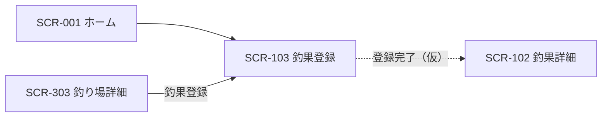

# SCR-103 釣果登録画面

## 1. 基本情報
| 項目 | 内容 |
| --- | --- |
| 画面ID | SCR-103 |
| 画面名 | 釣果登録画面 |
| URL・パス | `/catches/new` |
| 概要（1行） | 釣果を新規登録する。あわせて釣行の記録も保存する |
| 対象ユーザー・権限 | 全ユーザー（権限による出し分けは保留 → [README.md](./README.md) の「権限の扱い」） |
| 関連画面 | SCR-001 ホーム画面 / SCR-002 検索画面 / SCR-101 釣果一覧画面 / SCR-102 釣果詳細画面 / SCR-201 魚一覧画面 / SCR-301 釣り場一覧画面 / SCR-302 地図画面 / SCR-303 釣り場詳細画面 / SCR-501 マスタ追加画面 |
| ステータス | 下書き |
| デザインカンプ | [Figma: セリオ釣りMAP ＞ 入力フォーム（node-id=1158-1753）](https://www.figma.com/design/LgJDTLLmkMfjeamo0zQl2b/%E3%82%BB%E3%83%AA%E3%82%AA%E9%87%A3%E3%82%8AMAP?node-id=1158-1753) |

> **Figma のフレームは入力欄が4つ並んでいるだけで、ラベルはすべてテンプレ既定の `Label`、値は `Value` です。**どの項目を何個入力させるかは Figma から一切読み取れません（課題1参照）。本設計書の「4. 画面項目」は**入力欄の存在**だけを記録し、項目の中身は `（記入）` を残しています。

## 2. 画面概要
釣果を新規登録する画面です。
グローバルナビの FAB（＋）と、各画面の「釣果登録」ボタンからの遷移先になります。
Figma のキャンバスには「釣果の追加を行う。ドロップダウンによってユーザ、魚？釣り場？の情報を選択させる。」という注釈が置かれており、既存マスタからの選択を主体とする入力方式が意図されています（課題2参照）。
[CLAUDE.md](../../CLAUDE.md) のドメインモデルのとおり、**釣行（Trip）は専用画面を持たず、本画面から入力したデータを釣行記録として保存**します（課題3参照）。

## 3. 画面レイアウト
**レイアウトの正典は Figma**。この設計書には対象フレームの URL を必ず記載する（「1. 基本情報＞デザインカンプ」と一致させる）。
見た目の詳細は Figma を参照し、ここでは URL とレスポンシブ方針・補足のみを扱う。

- **Figma フレーム URL**: https://www.figma.com/design/LgJDTLLmkMfjeamo0zQl2b/%E3%82%BB%E3%83%AA%E3%82%AA%E9%87%A3%E3%82%8AMAP?node-id=1158-1753
- **レスポンシブ方針（PC）**: 左に固定幅のサイドバー（Navigation Rail）、右に可変幅のメインコンテンツを置く2カラム構成。メインコンテンツは入力欄（`Input Field`）を縦に4つ並べた1カラムのフォーム。
- **レスポンシブ方針（SP）**: （記入）— Navigation Rail に「押すと広がる」と注記があり、ハンバーガー押下で展開する想定。

簡易ワイヤー（詳細は Figma が正典）:

```
+---+--------------------------------------+
| ≡ |  Label                               |
|   |  +--------------------------------+  |
| ＋|  | Value                          |  |
|   |  +--------------------------------+  |
| ● |  Label                               |
|map|  +--------------------------------+  |
| ○ |  | Value                          |  |
|一覧|  +--------------------------------+  |
| ○ |  Label                               |
|検索|  +--------------------------------+  |
| ○ |  | Value                          |  |
|お気|  +--------------------------------+  |
|   |  Label                               |
|   |  +--------------------------------+  |
|   |  | Value                          |  |
+---+--------------------------------------+
  ↑ サイドバー
    ● = 背景色付きの角丸（Figma では「map」に付いている。課題5参照）
    ※ 登録・キャンセルのボタンは Figma に存在しない（課題4参照）
```

> 画面項目（4.）・状態（6.）のテキストは Figma フレーム（node-id=1158-1753）から起こしています。

## 4. 画面項目
Figma フレームから読み取れる要素のみを記載しています。入力欄のラベル・値・説明・エラー文言はすべてテンプレ既定のダミーのため `（記入）` を残しています。

| No | 項目名 | 種別 | 必須 | 説明・制約（桁数 / 形式 / 初期値 など） |
| --- | --- | --- | --- | --- |
| 1 | メニュー開閉ボタン（ハンバーガー） | ボタン | − | サイドバー上部に配置。共通コンポーネントに「押すと広がる」と注記あり |
| 2 | 釣果登録ボタン（＋、サイドバー） | ボタン | − | サイドバー上部、ナビ項目とは別枠。**本画面が釣果登録画面のため、自画面への導線になっている**（課題6参照） |
| 3 | ナビ項目「map」/「一覧」/「検索」/「お気に入り」 | リンク | − | アイコン＋ラベルの4項目。本画面はナビ直結ではないため、いずれも現在地にはならない想定（課題5参照） |
| 4 | 入力欄1 | （記入） | （記入） | Figma のラベルは `Label`、値は `Value`（いずれもテンプレ既定のダミー）。項目名・種別・必須可否・桁数・形式・初期値がすべて（記入）（課題1参照） |
| 5 | 入力欄2 | （記入） | （記入） | 同上 |
| 6 | 入力欄3 | （記入） | （記入） | 同上 |
| 7 | 入力欄4 | （記入） | （記入） | 同上 |

各入力欄（`Input Field`）は次の4要素で構成されています。Figma 上の表示・非表示は以下のとおりです。

| 要素 | Figma のレイヤー | 表示 | 内容 |
| --- | --- | --- | --- |
| ラベル | `Label` | 表示 | `Label`（ダミー） |
| 補足説明 | `Description` | **非表示** | `Description`（ダミー）。使う項目があるかは（記入） |
| 入力値 | `Input > Value` | 表示 | `Value`（ダミー） |
| エラー文言 | `Error` | **非表示** | `Error`（ダミー）。バリデーション時に表示する想定（課題7参照） |

## 5. アクション / イベント
Figma には登録・キャンセルの操作要素が存在しないため、フォームの確定操作は未確定です（課題4参照）。

| 操作（トリガー） | 挙動（処理内容） | 遷移先・結果 |
| --- | --- | --- |
| ハンバーガー押下 | Navigation Rail を展開する（「押すと広がる」） | 同画面でサイドバーの表示状態が変わる |
| サイドバー「＋」押下 | （記入：本画面が釣果登録画面のため挙動が未定。課題6参照） | （記入） |
| ナビ「map」/「一覧」/「検索」押下 | 各画面へ遷移 | SCR-302 地図画面 / SCR-201 魚一覧画面 / SCR-002 検索画面へ遷移（仮）。**入力中の内容の破棄確認が必要かは（記入）**（課題8参照） |
| ナビ「お気に入り」押下 | お気に入り画面へ遷移 | SCR-003 お気に入り画面へ遷移。**機能自体が保留**（T-38） |
| 入力欄へ入力 | （記入：ドロップダウンからの選択か自由入力か。課題2参照） | 同画面で入力値が更新される |
| 登録操作 | （記入：Figma に登録ボタンが存在しない。課題4参照） | （記入：SCR-102 釣果詳細画面へ遷移と推測） |
| キャンセル操作 | （記入：Figma にキャンセルボタンが存在しない。課題4参照） | （記入） |

## 6. 表示・状態
表示条件と、状態ごとの見せ方を記入する。該当しない状態の行は削除してよい。

| 状態 | 表示条件 | 表示内容 |
| --- | --- | --- |
| 通常（新規） | 画面表示時 | 入力欄4つを空（または初期値）で表示する。遷移元によって初期値が入るか（釣り場詳細から来た場合の釣り場など）は（記入）（課題9参照） |
| 入力エラー | バリデーション違反 | 各入力欄の `Error` を表示する（Figma 上は非表示）。文言・表示契機は（記入）（課題7参照） |
| ローディング | 選択肢（マスタ）の取得中・登録処理中 | （記入） |
| エラー | 登録・通信失敗 | （記入） |
| 権限なし | — | **保留**（ログイン機能を実装しないため当面は発生しない → [README.md](./README.md) の「権限の扱い」） |

## 7. 画面遷移
- **遷移元**: SCR-001 ホーム画面（「釣果を登録する」ボタン／サイドバーの FAB。Figma の矢印 `ホーム画面 --> 入力フォーム`）/ SCR-303 釣り場詳細画面（本文中の「釣果登録」ボタン）/ 全画面のグローバルナビの FAB
- **遷移先**: SCR-102 釣果詳細画面（登録完了後、仮）



全体の遷移は [screen-transition.md](./screen-transition.md) を参照してください。

## 8. 備考・課題
本設計書は 2026-08-31 に Figma フレーム（node-id=1158-1753）から新規に起こしたものです。**フレームがテンプレ既定の入力欄4つのみで、入力項目が一切決まっていません。**本画面は設計上の未確定度が最も高い画面です。以下は仕様確定時に解消してください。

1. **入力項目が未確定（最重要）** — Figma には `Input Field` が4つ並んでいるだけで、ラベルは全て `Label`、値は全て `Value` です。**どの項目を入力させるのか、いくつ必要なのかが Figma から一切読み取れません。**一方で [docs/tasks.md](../tasks.md) の「ドメイン型の内容」のとおり、既存実装の釣果（`FishingResult`）は魚種・釣り人・釣り種別・道具・タックル・餌・水質・釣れた日時・潮・天気・水温・風速・風向・波高・水深・ヒットパターン・サイズ・リリース有無・メモと**20項目近く**を持ちます。入力欄4つとの差が大きく、Figma 側の設計が追い付いていない状態です。
2. **入力方式が「ドロップダウン」と注釈されている** — Figma キャンバスの注釈は「釣果の追加を行う。ドロップダウンによってユーザ、魚？釣り場？の情報を選択させる。」です。既存マスタからの選択を主体とする方針は読み取れますが、**注釈自体に「魚？釣り場？」と疑問符が付いており、何を選択させるかは書いた本人も未確定**です。フレーム上の `Input Field` もドロップダウンではなくテキスト入力の見た目です。
3. **釣行（Trip）の入力範囲が未整理** — [CLAUDE.md](../../CLAUDE.md) のドメインモデルでは、釣行は専用画面を持たず本画面から入力したデータを釣行記録として保存します。釣行が持つ属性（釣行日・開始/終了時刻・釣り場・混雑度・メモ・同行者）のうち**どれを本画面で入力させるのか、1回の登録で釣果を複数件登録できるのか**（釣行1件に釣果 N 件がぶら下がるモデルのため）が未確定です。[docs/tasks.md](../tasks.md) の T-23・T-34 と一体で決める必要があります。
4. **登録・キャンセルのボタンが無い** — Figma のフレームに送信ボタン・キャンセルボタンが存在しません。フォームの確定操作、確定後の遷移先（釣果詳細へ進むのか、元の画面へ戻るのか）、確認ダイアログの要否がすべて未確定です。
5. **ナビの選択中表示が「map」のまま** — 本画面はナビ直結ではないにもかかわらず、背景色付きの角丸が `map` に付いています。他画面と同様の未整理です（[SCR-303](./SCR-303-spot-detail.md) 課題2参照）。
6. **サイドバーの FAB が自画面を指している** — 本画面は FAB の遷移先そのものです。釣果登録画面を開いている間の FAB の扱い（非表示にする／無効化する／何もしない）を決める必要があります。
7. **バリデーションが未定** — 各 `Input Field` は `Error` 要素を持ちますが Figma 上は非表示です。必須チェック・形式チェックの内容、エラー文言、表示契機（入力中／フォーカスアウト時／送信時）がすべて未確定です。**Figma からは必須可否・桁数・形式が取れないため、ここは人が決める必要があります。**
8. **入力中の離脱時の扱いが未定** — 入力途中でグローバルナビから他画面へ移動した場合に、破棄確認を出すか・下書きを保持するかが未確定です。
9. **遷移元からの初期値の引き継ぎが未定** — [SCR-303 釣り場詳細画面](./SCR-303-spot-detail.md) の「釣果登録」ボタンは当該釣り場を初期値として引き継ぐ想定ですが（[SCR-303](./SCR-303-spot-detail.md) 課題3）、サイドバーの FAB から開いた場合との差、初期値を URL に持たせるか（`/catches/new?spot=...`）が未確定です。
10. **写真の入力欄が無い** — [CLAUDE.md](../../CLAUDE.md) のドメインモデルでは釣果は写真に紐づき、[SCR-101](./SCR-101-catch-list.md)・[SCR-102](./SCR-102-catch-detail.md)・[SCR-303](./SCR-303-spot-detail.md) はいずれも釣果の写真を表示します。**登録画面に画像アップロードの要素がありません。**
11. **マスタ未登録の魚・釣り場をどう扱うかが未整理** — [SCR-501 マスタ追加画面](./SCR-501-master-add.md) の注釈は「マスタに追加するのはユーザがマスタに未登録の魚などを自動的に追加していく」です。本画面での入力時に未登録の魚種が指定されたらマスタへ自動追加する、という流れと読めますが、両画面の関係が未整理です（[SCR-501](./SCR-501-master-add.md) 課題2参照）。
12. **古い Navigation Rail が Figma に残存** — 本フレームには Navigation Rail が2つ重なっており、片方は4項目目が `入力` で FAB が非表示（`version1.0` 相当の消し忘れ）です。**正は `map` / `一覧` / `検索` / `お気に入り` ＋ FAB** です（[SCR-001](./SCR-001-home.md) 課題11・[SCR-501](./SCR-501-master-add.md) 課題6と同一）。Figma 側の整理が必要です。
13. **[SCR-501 マスタ追加画面](./SCR-501-master-add.md) とレイアウトがほぼ同一** — 入力欄の個数（本画面4つ／SCR-501 は5つ）以外は Navigation Rail の二重配置を含めて同じ構成です。共通のフォームテンプレートとして定義するか要確認。
14. **アイコンがすべてプレースホルダ** — 各ナビ項目の最終アイコンが未定。
15. **SP レイアウトが未定** — 入力欄の幅・ラベルの配置（上／横）の切り替え基準が未確定です。
16. **Material テンプレの残骸** — `Input Field` の `Label` / `Value` / `Description`（非表示）/ `Error`（非表示）、Navigation Rail の `Nav item 5`〜`7`（非表示）が残っています。

---

### 更新履歴
| 日付 | 版 | 変更内容 | 担当 |
| --- | --- | --- | --- |
| 2026-08-31 | 0.1 | 新規作成。Figma フレーム（node-id=1158-1753）から入力欄の構成とキャンバス注釈を起こした。入力項目が未確定である旨を課題1 に記載 | （記入） |
