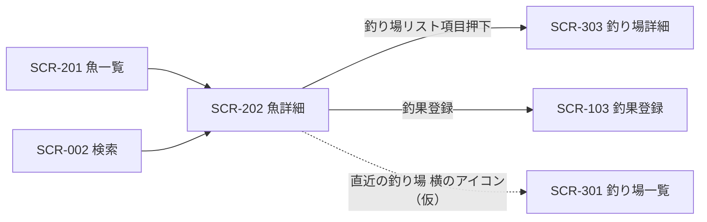

# SCR-202 魚詳細画面

## 1. 基本情報
| 項目 | 内容 |
| --- | --- |
| 画面ID | SCR-202 |
| 画面名 | 魚詳細画面 |
| URL・パス | `/fish/:id` |
| 概要（1行） | 魚1種の詳細（写真・説明・直近の釣り場）を表示する |
| 対象ユーザー・権限 | 全ユーザー（権限による出し分けは保留 → [README.md](./README.md) の「権限の扱い」） |
| 関連画面 | SCR-002 検索画面 / SCR-003 お気に入り画面 / SCR-102 釣果詳細画面 / SCR-103 釣果登録画面 / SCR-201 魚一覧画面 / SCR-301 釣り場一覧画面 / SCR-303 釣り場詳細画面 |
| ステータス | 下書き |
| デザインカンプ | [Figma: セリオ釣りMAP ＞ 魚詳細（node-id=1159-3015）](https://www.figma.com/design/LgJDTLLmkMfjeamo0zQl2b/%E3%82%BB%E3%83%AA%E3%82%AA%E9%87%A3%E3%82%8AMAP?node-id=1159-3015) |

> **本フレームはメインコンテンツ（`Content`）が2つ重なっており、中身が異なります。**片方は [SCR-303 釣り場詳細画面](./SCR-303-spot-detail.md)（`map詳細`）の複製そのもの、もう片方が本画面の設計（戻るリンク「魚一覧に戻る」／見出し「チヌ」／「直近の釣り場」）です。本設計書は**後者を採用**し、前者は消し忘れとして扱っています（課題1参照）。

## 2. 画面概要
魚（魚種）1件の詳細を表示する、図鑑の詳細にあたる画面です。
上部に魚の写真・名称・説明文と「釣果登録」ボタンを置き、下部に「直近の釣り場」としてその魚が釣れた釣り場を並べます。
魚一覧・検索・釣果詳細のいずれからも到達します。
ヘッダーの戻るリンクは遷移元を文言に含めており、Figma では「魚一覧に戻る」と表示されています（課題3参照）。

## 3. 画面レイアウト
**レイアウトの正典は Figma**。この設計書には対象フレームの URL を必ず記載する（「1. 基本情報＞デザインカンプ」と一致させる）。
見た目の詳細は Figma を参照し、ここでは URL とレスポンシブ方針・補足のみを扱う。

- **Figma フレーム URL**: https://www.figma.com/design/LgJDTLLmkMfjeamo0zQl2b/%E3%82%BB%E3%83%AA%E3%82%AA%E9%87%A3%E3%82%8AMAP?node-id=1159-3015
- **レスポンシブ方針（PC）**: 左に固定幅のサイドバー（Navigation Rail）、右に可変幅のメインコンテンツを置く2カラム構成。メインコンテンツは上から Top app bar（戻るリンク・アクションアイコン2つ）、魚情報ブロック（左に写真、右に名称・説明・釣果登録ボタンの横並び2カラム）、「直近の釣り場」セクション（縦積みのリスト3件）。
- **レスポンシブ方針（SP）**: （記入）— 魚情報ブロックを写真の上下積みに切り替える想定だが、Figma に情報がないため要確認。

> レイアウト構成は [SCR-303 釣り場詳細画面](./SCR-303-spot-detail.md)・[SCR-102 釣果詳細画面](./SCR-102-catch-detail.md) と**ほぼ同一**です（詳細画面3枚が同じテンプレートの複製）。共通化の要否は課題2を参照してください。

簡易ワイヤー（詳細は Figma が正典）:

```
+---+--------------------------------------+
| ≡ | ← 魚一覧に戻る           ◇    ◇     |
|   | +----------+  チヌ [編集]            |
| ＋| |          |  Published date         |
|   | |  写真    |  （説明文：2段落）      |
| ● | |          |                         |
|map| +----------+  [ 釣果登録 ]           |
| ○ |                                      |
|一覧| 直近の釣り場 ◇ ⇅                    |
| ○ | +----------------------------------+ |
|検索| |[写真] 宇野                        | |
| ○ | |       Description ...             | |
|お気| | ◇ Today・23 min              ◇  | |
|   | +----------------------------------+ |
|   | |[   ]  Title  （全3件）           | |
+---+--------------------------------------+
  ↑ サイドバー
    ● = 背景色付きの角丸（Figma では「map」に付いている。課題4参照）
    ◇ = アイコン（Figma 上はプレースホルダのため用途未確定）
    ⇅ = Sliders（並べ替え・絞り込みと推測されるが根拠なし。課題8参照）
```

> 画面項目（4.）・状態（6.）のテキストは Figma フレーム（node-id=1159-3015）から起こしています。

## 4. 画面項目
Figma フレームから読み取れる要素のみを記載しています。Figma 側がダミー値（`Published date` / `Lorem ipsum ...` / `Description ...` / `Today・23 min` / `Title`）のままの箇所は `（記入）` を残しています。

| No | 項目名 | 種別 | 必須 | 説明・制約（桁数 / 形式 / 初期値 など） |
| --- | --- | --- | --- | --- |
| 1 | メニュー開閉ボタン（ハンバーガー） | ボタン | − | サイドバー上部に配置。共通コンポーネントに「押すと広がる」と注記あり |
| 2 | 釣果登録ボタン（＋、サイドバー） | ボタン | − | サイドバー上部、ナビ項目とは別枠。本文中の「釣果登録」ボタン（No.10）と導線が重複（課題5参照） |
| 3 | ナビ項目「map」/「一覧」/「検索」/「お気に入り」 | リンク | − | アイコン＋ラベルの4項目。本画面はナビ直結ではないため、いずれも現在地にはならない想定（課題4参照） |
| 4 | 戻るリンク（← ＋ 文言） | リンク | − | Top app bar 左。Figma の表示は「魚一覧に戻る」。**遷移元に応じて文言が変わるか固定かが未定**（課題3参照） |
| 5 | ヘッダーアクション1 | ボタン | − | Top app bar 右（`trailing-icon 1`）。アイコンがプレースホルダで**用途が不明**（課題6参照）。お気に入り機能自体も保留（[docs/tasks.md](../tasks.md) の T-38） |
| 6 | ヘッダーアクション2 | ボタン | − | Top app bar 右端（`trailing-icon 3`。`trailing-icon 2` は非表示）。同上（課題6参照） |
| 7 | 魚の写真 | 画像 | − | 魚情報ブロック左側（`Header > Image`）。Figma 上は画像レイヤーが2枚（`image 1` / `image 4`）重なっている。複数枚を扱うか、画像が無い場合の代替表示は（記入）（課題7参照） |
| 8 | 魚名 | ラベル | ○ | Figma の表示は「チヌ」。標準和名／通称のどちらを出すかは（記入）（[SCR-201](./SCR-201-fish-list.md) 課題10と同一の論点） |
| 9 | 編集アイコン | ボタン | − | 魚名の右（Figma 上は `edit` という**中身が空のフレーム**）。魚情報の編集導線と推測されるが、対応する編集画面が [screen-list.md](./screen-list.md) に無い（課題9参照） |
| 10 | 説明文の見出し | ラベル | − | Figma の表示は `Published date`（ダミー・英語）。**魚に「公開日」を出す意味が読み取れず、表示すべき内容が未確定**（課題10参照） |
| 11 | 魚の説明文 | ラベル | − | Figma は Lorem ipsum の2段落。文字数上限・段落数・改行の扱い・折りたたみ（「続きを読む」）の要否は（記入） |
| 12 | 「釣果登録」ボタン | ボタン | − | 塗りボタン（`Header > Text column > Button`）。当該の魚を初期値として釣果を登録する想定と推測（課題5参照）。条件なし（保留: 会員のみ） |
| 13 | 「直近の釣り場」セクション見出し | ラベル | − | Figma の表示は「直近の釣り場」。この魚が釣れた釣り場を並べる想定と読めるが、「直近」の定義（期間か件数か）は（記入） |
| 14 | セクション見出し横のアイコンボタン | ボタン | − | 見出し右（`Title header > Icon button`）。アイコンがプレースホルダで**用途が不明**。[SCR-301 釣り場一覧画面](./SCR-301-spot-list.md) を魚で絞り込んだ状態への導線と推測されるが Figma に根拠なし（課題8参照） |
| 15 | セクション見出し横の Sliders | ボタン | − | 見出し右（`Title header > Sliders`）。並べ替え・絞り込みと推測されるが Figma に根拠なし（課題8参照） |
| 16 | 釣り場リスト項目 | その他 | − | 「直近の釣り場」内の1件分（`column 01 > List item 01` 〜 `03`）。Figma は3件。項目全体が釣り場詳細へのリンク。表示件数・並び順は（記入） |
| 17 | 釣り場のサムネイル | 画像 | − | リスト項目左側。画像が無い場合の代替表示は（記入） |
| 18 | 釣り場名 | ラベル | ○ | Figma の表示は1件目のみ「宇野」、2・3件目は `Title`（ダミー）。[SCR-303](./SCR-303-spot-detail.md) の「宇野港」と表記が揃っていない（課題11参照） |
| 19 | 釣り場の説明文 | ラベル | − | Figma の表示は `Description duis aute ...`（ダミー・英語）。表示内容・行数制限は（記入） |
| 20 | リスト項目のメタ情報 | ラベル | − | Figma の表示は `Today`（Date）＋ `•`（Separator）＋ `23 min`（Time）。**「23 min」が何を指すか不明**（課題12参照） |
| 21 | リスト項目のアイコン（左） | ボタン | − | メタ情報の左（`Leading & Trailing icons > Leading > Icon`）。**用途が不明**（課題12参照） |
| 22 | リスト項目のアイコン（右） | ボタン | − | リスト項目右端（同 `Icon`）。**用途が不明**（課題12参照） |

## 5. アクション / イベント

| 操作（トリガー） | 挙動（処理内容） | 遷移先・結果 |
| --- | --- | --- |
| ハンバーガー押下 | Navigation Rail を展開する（「押すと広がる」） | 同画面でサイドバーの表示状態が変わる |
| サイドバー「＋」押下 | 釣果の新規登録へ進む | SCR-103 釣果登録画面へ遷移（仮）。条件なし（保留: 会員のみ）。魚が引き継がれるかは課題5参照 |
| ナビ「map」/「一覧」/「検索」押下 | 各画面へ遷移 | SCR-302 地図画面 / SCR-201 魚一覧画面 / SCR-002 検索画面へ遷移（仮） |
| ナビ「お気に入り」押下 | お気に入り画面へ遷移 | SCR-003 お気に入り画面へ遷移。**機能自体が保留**（T-38） |
| 戻るリンク押下 | 遷移元の画面へ戻る | Figma の文言は「魚一覧に戻る」＝ SCR-201 魚一覧画面。課題3参照 |
| ヘッダーアクション1 押下 | （記入：用途不明。お気に入り登録・解除と推測） | （記入）。**お気に入り機能自体が保留**（T-38） |
| ヘッダーアクション2 押下 | （記入：用途不明） | （記入） |
| 編集アイコン押下 | （記入：魚情報の編集と推測） | （記入：対応する編集画面が未定義。課題9参照） |
| 「釣果登録」ボタン押下 | 当該の魚に紐づけて釣果を登録する（推測） | SCR-103 釣果登録画面へ遷移。魚を初期値として引き継ぐかは（記入）（課題5参照） |
| セクション見出し横のアイコンボタン押下 | （記入：用途不明。この魚が釣れる釣り場の一覧へ進む導線と推測） | （記入：SCR-301 釣り場一覧画面を魚で絞り込んだ状態と推測。課題8参照） |
| Sliders 押下 | （記入：並べ替え・絞り込みと推測） | （記入）（課題8参照） |
| 釣り場リスト項目押下 | 当該の釣り場の詳細へ進む | SCR-303 釣り場詳細画面へ遷移 |
| リスト項目のアイコン（左 / 右）押下 | （記入：用途不明） | （記入） |

## 6. 表示・状態
表示条件と、状態ごとの見せ方を記入する。該当しない状態の行は削除してよい。

| 状態 | 表示条件 | 表示内容 |
| --- | --- | --- |
| 通常 | 当該の魚が存在し、釣り場が1件以上 | 魚情報ブロックと「直近の釣り場」リストを表示する |
| データ空（Empty） | 当該の魚の釣り場が 0 件 | （記入）— 「直近の釣り場」セクションごと非表示にするのか、案内文を出すのか要確認 |
| ローディング | 魚・釣り場データの取得中 | （記入） |
| エラー | 取得・通信失敗 | （記入）— 存在しない `:id` を指定された場合の扱い（404 表示など）も要確認 |
| 権限なし | — | **保留**（ログイン機能を実装しないため当面は発生しない → [README.md](./README.md) の「権限の扱い」） |

## 7. 画面遷移
- **遷移元**: SCR-201 魚一覧画面（魚カード押下。Figma の矢印 `魚一覧表示 --> 魚詳細`）/ SCR-002 検索画面（検索結果カード押下。Figma の矢印 `検索 --> 魚詳細`）/ SCR-102 釣果詳細画面（仮）
- **遷移先**: SCR-303 釣り場詳細画面（釣り場リスト項目）/ SCR-103 釣果登録画面（「釣果登録」ボタン・サイドバー「＋」）/ SCR-301 釣り場一覧画面（「直近の釣り場」見出し横のアイコン、仮）



全体の遷移は [screen-transition.md](./screen-transition.md) を参照してください。

## 8. 備考・課題
本設計書は 2026-08-31 に Figma フレーム（node-id=1159-3015）から新規に起こしたものです。説明文・釣り場リストの中身がダミー値のため未確定の箇所が多く残っています。以下は仕様確定時に解消してください。

1. **メインコンテンツが二重に配置され、中身が違う** — 本フレームには `Content` が2つ重なっています。1つ目は [SCR-303 釣り場詳細画面](./SCR-303-spot-detail.md)（`map詳細`）の複製そのもの（戻るリンク「mapに戻る」／見出し「宇野港」／「最近の釣果」／「チヌ」）で、**本画面の設計ではありません**。2つ目（戻るリンク「魚一覧に戻る」／見出し「チヌ」／「直近の釣り場」）を本設計書では採用しました。Figma 側で1つ目を削除する必要があります。[SCR-102](./SCR-102-catch-detail.md) 課題1・[SCR-303](./SCR-303-spot-detail.md) 課題20と同種の問題です。
2. **詳細画面3枚が同じテンプレートの複製** — [SCR-303 釣り場詳細画面](./SCR-303-spot-detail.md)・[SCR-102 釣果詳細画面](./SCR-102-catch-detail.md)・本画面は、Top app bar（戻るリンク・アクション2つ）、写真＋テキスト2カラムの `Header`、`Simple card grid` によるリスト3件という**同一構成**です。差分は見出し・セクション名（「最近の釣果」/「直近の釣り場」）・1件目のダミーテキストのみです。共通の詳細テンプレートとして定義し、各画面では差分のみ記述する方針にするか要確認。3画面の課題も大半が共通しています。
3. **戻るリンクの文言が遷移元依存** — Figma は「魚一覧に戻る」で、遷移元（魚一覧画面）を文言に含めています。本画面は魚一覧・検索・釣果詳細から到達しうるため、(a) 遷移元に応じて文言を動的に変えるのか、(b) 固定文言にするのか、(c) 直接 URL で開かれた場合に何を表示するのかが要確認です。[SCR-303](./SCR-303-spot-detail.md) 課題1と同一の論点で、全画面で方式を揃える必要があります。
4. **ナビの選択中表示が「map」のまま** — 本画面はナビ直結ではないにもかかわらず、背景色付きの角丸が `map` に付いています。詳細画面など「ナビのどの項目にも対応しない画面」で現在地表示をどう扱うかの仕様確定が必要です（[SCR-303](./SCR-303-spot-detail.md) 課題2と同一）。
5. **釣果登録の導線が2つある** — サイドバーの「＋」と本文中の「釣果登録」ボタンです。本文側は当該の魚を初期値として引き継ぐ想定と推測されますが、**Figma に根拠はありません**。サイドバー側との使い分けを明示する必要があります（[SCR-303](./SCR-303-spot-detail.md) 課題3と同一）。
6. **ヘッダーアクション2つの用途が不明** — Figma 上は Material の Top app bar の `trailing-icon 1` と `3`（`2` は非表示）がそのまま残っており、アイコンも差し替えられていません。お気に入り登録がここに入るのかを含めて用途の定義が必要です（[SCR-303](./SCR-303-spot-detail.md) 課題4と同一）。
7. **魚の写真の扱いが未定** — Figma では `Image` フレームに画像レイヤーが2枚（`image 1` / `image 4`）重なっています。複数枚を扱うか（カルーセル）、写真が無い魚の代替表示が未定です。
8. **セクション見出し横のアイコン2つの用途が不明** — `Icon button`（プレースホルダ）と `Sliders` が並んでいます。`Sliders` は Material の設定・絞り込み用アイコンですが Figma 上に根拠はありません。[SCR-301 釣り場一覧画面](./SCR-301-spot-list.md) のタイトルが「チヌが釣れる釣り場」＝魚で絞り込んだ状態であることから、`Icon button` がそこへの導線である可能性がありますが未確定です（[SCR-301](./SCR-301-spot-list.md) 課題2参照）。**この2つは [SCR-102 釣果詳細画面](./SCR-102-catch-detail.md) にも同じく置かれており**、両画面で一体に確定させる必要があります。
9. **編集導線に対応する画面が無い** — 魚名の右に `edit` というフレーム（中身は空）が置かれています。魚情報の編集画面が [screen-list.md](./screen-list.md) に定義されていません。なお `version1.0` キャンバスには「自分が追加した魚情報は魚詳細から消せるようにしたい」という注釈があり、**マスタの編集・削除に関する要求が存在します**（[SCR-303](./SCR-303-spot-detail.md) 課題18・[SCR-501](./SCR-501-master-add.md) 課題3と同一の論点）。
10. **説明文の見出しが `Published date`** — 魚に「公開日」を出す意味が読み取れません。Material のテンプレートの既定要素が残っているだけの可能性があります。この位置に何を表示するか（分類・生息域・釣れる時期・削除して説明文のみにする）を確定させる必要があります。[SCR-102](./SCR-102-catch-detail.md) では同じ位置に「魚種、釣れた匹、天気、最大サイズ」が入っており、**属性を並べる場所として使う意図**が読み取れます。
11. **釣り場名の表記が揃っていない** — リスト1件目の表示は「宇野」で、[SCR-303](./SCR-303-spot-detail.md)・[SCR-302](./SCR-302-map.md) の「宇野港」と異なります。正式名称の扱い（略称を持つか）を確認してください。
12. **リスト項目のメタ情報とアイコンが不明** — `Today`（Date）・`•`（Separator）・`23 min`（Time）という構成で、「23 min」が何を指すか読み取れません。左右のアイコンも `Icon` というプレースホルダのままです。**Material の動画・音声リスト用コンポーネントの既定要素が残っている**ことが Figma のレイヤー構造から確認できます（[SCR-303](./SCR-303-spot-detail.md) 課題10と同一）。
13. **魚図鑑としての情報が無い** — [CLAUDE.md](../../CLAUDE.md) のドメインモデルでは魚は「魚種の情報。関連する釣果を持つ」とされていますが、本画面には分類（目・科）・釣れる時期・生息域・サイズの目安といった図鑑らしい項目がありません。また**関連する釣果の一覧も無く**、代わりに「直近の釣り場」が置かれています。図鑑として何を載せるか要確認です。
14. **説明文が英語のダミー** — Lorem ipsum・`Description ...`・`Today` / `23 min` はすべて英語のダミーです。日本語での表示文言の確定が必要です。
15. **アイコンがすべてプレースホルダ** — 各ナビ項目の最終アイコンが未定。
16. **SP レイアウトが未定** — 魚情報ブロックの2カラムを縦積みに切り替える基準は未確定です。
17. **Material テンプレの残骸** — `Published date`、リスト項目の `Title` / `Description ...`、Navigation Rail の `Nav item 5`〜`7`（非表示）が残っています。

---

### 更新履歴
| 日付 | 版 | 変更内容 | 担当 |
| --- | --- | --- | --- |
| 2026-08-31 | 0.1 | 新規作成。Figma フレーム（node-id=1159-3015）から項目表・アクション・状態を起こした。`Content` 二重配置のうち「魚一覧に戻る」側を採用した旨を課題1 に記載 | （記入） |
