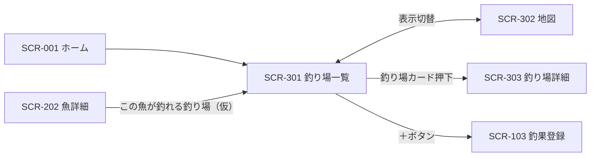

# SCR-301 釣り場一覧画面

## 1. 基本情報
| 項目 | 内容 |
| --- | --- |
| 画面ID | SCR-301 |
| 画面名 | 釣り場一覧画面 |
| URL・パス | `/spots` |
| 概要（1行） | 釣り場をカードのグリッドで一覧表示する（地図表示に切替可） |
| 対象ユーザー・権限 | 全ユーザー（権限による出し分けは保留 → [README.md](./README.md) の「権限の扱い」） |
| 関連画面 | SCR-001 ホーム画面 / SCR-002 検索画面 / SCR-003 お気に入り画面 / SCR-103 釣果登録画面 / SCR-202 魚詳細画面 / SCR-302 地図画面 / SCR-303 釣り場詳細画面 |
| ステータス | 下書き |
| デザインカンプ | [Figma: セリオ釣りMAP ＞ 釣り場一覧（node-id=1159-2582）](https://www.figma.com/design/LgJDTLLmkMfjeamo0zQl2b/%E3%82%BB%E3%83%AA%E3%82%AA%E9%87%A3%E3%82%8AMAP?node-id=1159-2582) |

## 2. 画面概要
釣り場をカードのグリッドで一覧表示する画面です。
グローバルナビからの直接の導線は無く、詳細画面などからの遷移先と推測されます（課題1参照）。
画面上部に絞り込みチップを置き、その下に釣り場カードを格子状に並べます。
モックのタイトルが「チヌが釣れる釣り場」となっており、条件で絞り込んだ状態の一覧として描かれています（課題2参照）。

## 3. 画面レイアウト
**レイアウトの正典は Figma**。この設計書には対象フレームの URL を必ず記載する（「1. 基本情報＞デザインカンプ」と一致させる）。
見た目の詳細は Figma を参照し、ここでは URL とレスポンシブ方針・補足のみを扱う。

- **Figma フレーム URL**: https://www.figma.com/design/LgJDTLLmkMfjeamo0zQl2b/%E3%82%BB%E3%83%AA%E3%82%AA%E9%87%A3%E3%82%8AMAP?node-id=1159-2582
- **レスポンシブ方針（PC）**: 左に固定幅のサイドバー（Navigation Rail）、右に可変幅のメインコンテンツを置く2カラム構成。メインコンテンツは上から Top app bar（戻る・タイトル・アクションアイコン）・絞り込みチップ・カードグリッドの縦積み。Figma のグリッドは5列・**カード22枚**。
- **レスポンシブ方針（SP）**: （記入）— Navigation Rail に「押すと広がる」と注記があり、ハンバーガー押下で展開する想定。グリッドの列数の切り替え基準は未定（課題9参照）。

簡易ワイヤー（詳細は Figma が正典）:

```
+---+--------------------------------------+
| ≡ | ←                      ◇   ◇   ◇    |
|   | チヌが釣れる釣り場                   |
| ＋| +----------------------------------+ |
|   | |[Label][✓Label][Label][Label][…] | |
| ● | |                                  | |
|map| | [画像] [画像] [画像] [画像] [画像]| |
| ○ | |  Title  Title  Title  Title  Title| |
|一覧| |  Upd... Upd... Upd... Upd... Upd..| |
| ○ | | [画像] [画像] [画像] [画像] [画像]| |
|検索| |  Title  Title  Title  Title  Title| |
| ○ | | （全22枚。以下スクロール）       | |
|お気| +----------------------------------+ |
+---+--------------------------------------+
  ↑ サイドバー
    ● = 背景色付きの角丸（Figma では「map」に付いている。課題3参照）
    ◇ = ヘッダーアクション（プレースホルダのため用途未確定。課題5参照）
```

> 画面項目（4.）・状態（6.）のテキストは Figma フレーム（node-id=1159-2582）から起こしています。

## 4. 画面項目
モックから読み取れる要素のみを記載しています。モックがダミー値（`Label` / `Title` / `Updated today` など）の箇所は `（記入）` を残しています。

| No | 項目名 | 種別 | 必須 | 説明・制約（桁数 / 形式 / 初期値 など） |
| --- | --- | --- | --- | --- |
| 1 | メニュー開閉ボタン（ハンバーガー） | ボタン | − | サイドバー上部に配置。押下時の挙動は要確認（サイドバーの折りたたみ／SP でのドロワー開閉） |
| 2 | 釣果登録ボタン（＋） | ボタン | − | サイドバー上部、ナビ項目とは別枠。背景色付きの角丸で強調表示。全ユーザーに表示（保留: 会員のみ） |
| 3 | ナビ項目「map」 | リンク | − | アイコン＋ラベル |
| 4 | ナビ項目「一覧」 | リンク | − | アイコン＋ラベル。本画面が現在地と推測（課題1参照） |
| 5 | ナビ項目「検索」 | リンク | − | アイコン＋ラベル |
| 6 | ナビ項目「お気に入り」 | リンク | − | アイコン＋ラベル。遷移先は SCR-003 お気に入り画面。**機能自体が保留**（[docs/tasks.md](../tasks.md) の T-38） |
| 7 | 戻るボタン（←） | ボタン | − | Top app bar 左端（`leading-icon`）。遷移元へ戻る。グローバルナビから直接開いた場合の戻り先は（記入）（課題4参照） |
| 8 | 画面タイトル | ラベル | ○ | Figma の表示は「チヌが釣れる釣り場」。絞り込み条件を反映した動的な文言と推測（課題2参照）。桁数・省略表示の要否は（記入） |
| 9 | ヘッダーアクション1 | ボタン | − | Top app bar 右（`trailing-icon 1`）。アイコンがプレースホルダで**用途が不明**（課題5参照） |
| 10 | ヘッダーアクション2 | ボタン | − | Top app bar 右（`trailing-icon 2`）。同上（課題5参照） |
| 11 | ヘッダーアクション3 | ボタン | − | Top app bar 右端（`trailing-icon 3`）。同上。地図表示への切替がここに入る可能性あり（課題6参照） |
| 12 | 絞り込みチップ | チェックボックス | − | Figma では `Label` が5個。選択中はチェックマーク（✓）＋背景色付きで表示。選択肢の内容・個数・単一選択か複数選択かがすべて（記入）。[SCR-002 検索画面](./SCR-002-search.md) のチップと同一コンポーネントのため、選択肢を共通化するか要確認（課題7参照） |
| 13 | 釣り場カード | その他 | − | グリッドの1マス。Figma は5列・22枚。カード全体が釣り場詳細へのリンク |
| 14 | 釣り場サムネイル | 画像 | − | カード上部（`Image`）。Figma 上はすべてプレースホルダ。画像が無い場合の代替表示は（記入） |
| 15 | 釣り場名 | ラベル | ○ | Figma の表示は `Title`（ダミー）。桁数・省略表示の要否は（記入） |
| 16 | サブテキスト | ラベル | − | モックの表示は `Updated today` / `Updated yesterday` / `Updated 2 days ago`（ダミー・英語）。表示する内容（更新日時か、釣れる魚種・エリアなどの属性か）が未確定。[SCR-002](./SCR-002-search.md) の課題6と同一 |

## 5. アクション / イベント
ナビの遷移先は、既存の画面一覧に当てはめた**仮案**です（「8. 備考・課題」の課題1参照）。

| 操作（トリガー） | 挙動（処理内容） | 遷移先・結果 |
| --- | --- | --- |
| ハンバーガー押下 | サイドバーの表示／非表示を切り替える（挙動は要確認） | 同画面でサイドバーの表示状態が変わる |
| 「＋」ボタン押下 | 釣果の新規登録へ進む | SCR-103 釣果登録画面へ遷移（仮）。条件なし（保留: 会員のみ） |
| ナビ「map」押下 | 地図画面へ遷移 | SCR-302 地図画面へ遷移（仮） |
| ナビ「検索」押下 | 検索画面へ遷移 | SCR-002 検索画面へ遷移（仮） |
| ナビ「お気に入り」押下 | お気に入り画面へ遷移 | SCR-003 お気に入り画面へ遷移。**機能自体が保留**（T-38） |
| 戻るボタン（←）押下 | 直前の画面へ戻る | （記入：遷移元による。課題4参照） |
| ヘッダーアクション1 押下 | （記入：用途不明） | （記入） |
| ヘッダーアクション2 押下 | （記入：用途不明） | （記入） |
| ヘッダーアクション3 押下 | （記入：用途不明。地図表示への切替が入る可能性あり） | （記入） |
| 絞り込みチップ押下 | 当該条件の選択・解除を切り替え、一覧を絞り込む | 同画面でチップの選択状態と一覧が更新される。画面タイトルも連動するかは（記入） |
| 釣り場カード押下 | 当該の釣り場の詳細へ進む | SCR-303 釣り場詳細画面へ遷移 |
| 一覧末尾までスクロール | （記入：追加読み込みかページングか） | （記入）（課題10参照） |

## 6. 表示・状態
表示条件と、状態ごとの見せ方を記入する。該当しない状態の行は削除してよい。

| 状態 | 表示条件 | 表示内容 |
| --- | --- | --- |
| 通常 | 該当する釣り場が1件以上 | 絞り込みチップと釣り場カードのグリッドを表示する。モックは5列 |
| ローディング | 一覧データの取得中 | （記入） |
| データ空（Empty） | 該当データ 0 件 | （記入）— 絞り込みで0件になった場合の案内文・条件解除の導線を含めて要確認 |
| エラー | 取得・通信失敗 | （記入） |

## 7. 画面遷移
- **遷移元**: SCR-001 ホーム画面 / SCR-202 魚詳細画面（「この魚が釣れる釣り場」からの絞り込み遷移と推測、課題2参照）/ SCR-302 地図画面（一覧 ⇄ 地図 の表示切替）/ 全画面のグローバルナビ「一覧」
- **遷移先**: SCR-303 釣り場詳細画面 / SCR-302 地図画面（表示切替）/ SCR-103 釣果登録画面（＋ボタン、仮）



全体の遷移は [screen-transition.md](./screen-transition.md) を参照してください。

## 8. 備考・課題
本設計書はブラウザモック画像1枚から起こしたもので、カードの中身がダミー値のため未確定の箇所が多く残っています。以下は仕様確定時に解消してください。

1. **グローバルナビ「一覧」の対応画面は本画面ではない可能性がある** — [SCR-201 魚一覧画面](./SCR-201-fish-list.md) のモックでは注目枠がナビ「一覧」に付いており、同じ注記の使われ方は [SCR-302 地図画面](./SCR-302-map.md)（枠は `map`）、[SCR-002 検索画面](./SCR-002-search.md)（枠は `検索`）でも一貫しています。**本画面のモックには注目枠が無い**ため、ナビ「一覧」の対応先は SCR-201 魚一覧で、本画面はナビ直結ではなく詳細画面などからの遷移先（課題2参照）と推測されます。ただしモックの注記からの推測にすぎないため、ナビ「一覧」の対応先を確定させ、確定後に SCR-002・SCR-201・SCR-302 の記載も揃える必要があります。
2. **画面タイトルが「チヌが釣れる釣り場」で、条件付きの一覧になっている** — [screen-list.md](./screen-list.md) の概要は「釣り場の一覧」ですが、モックは魚種で絞り込んだ状態です。(a) 条件なしの素の一覧と同一画面なのか別画面なのか、(b) タイトルが絞り込み条件に応じて動的に変わるのか、(c) [SCR-202 魚詳細画面](./SCR-202-fish-detail.md) からの導線専用なのか、(d) URL に条件を持たせるか（`/spots?fish=...`）が要確認です。
3. **ナビの選択中表示が「一覧」ではなく「map」になっている** — 背景色付きの角丸が `map` に付いたままです。[SCR-001](./SCR-001-home.md)・[SCR-302](./SCR-302-map.md)・[SCR-002](./SCR-002-search.md) のモックでも同様で、これで4画面目です。モック側で現在地表示を更新していないだけと考えられますが、現在地表示の仕様を確定させる必要があります。
4. **戻るボタン（←）の戻り先が未定** — グローバルナビから直接開いた場合、戻る先がありません。ナビ経由では非表示にするのか、常に表示してホームへ戻すのか要確認。
5. **ヘッダーアクション3つの用途が不明** — Figma 上は Material の Top app bar の `trailing-icon 1` 〜 `3` がそのまま残っており、アイコンも差し替えられていません。当初モック画像から「クリップ」「カレンダー」「⋮」と読み取っていましたが、**Figma 上にその根拠はありません**。残すなら用途の定義が、不要なら削除が必要です。
6. **地図表示への切替導線がモックに見当たらない** — [screen-transition.md](./screen-transition.md) には「SCR-301 釣り場一覧 ⇄ SCR-302 地図 の表示切替」が定義されていますが、モックに切替 UI がありません。⋮ メニューの中にあるのか、そもそも切替を廃止したのか要確認。
7. **絞り込みチップの中身が未定・検索画面との関係が未整理** — モックは `Label` が5個で2番目が選択中と、[SCR-002 検索画面](./SCR-002-search.md) のチップと同一の見た目です。何で絞り込むのか（魚種／エリア／設備など）、単一選択か複数選択か、両画面で選択肢を共通化するかが要確認です。
8. ~~**1枚目のカードだけ名称・サブテキストが無い**~~ — **解消**。Figma では `Card 01` 〜 `Card 22` の**すべてが同一構成**（`Image` ＋ `Title` ＋ `Date`）です。モック画像で1枚目が写真のみに見えていたのは、カードグリッドの上に別レイヤーの画像（`image 4`）が重なっていたためでした。
9. **グリッドの列数のレスポンシブ方針が未定** — Figma は5列ですが、幅に応じて何列まで減らすかの基準が不明です。
10. **一覧の件数制御が未定** — Figma はカード22枚を並べていますが、これが初期表示件数を意味するのかは不明です。続きを見る導線（「もっと見る」／ページング／無限スクロール）、並び順（新着順／人気順／距離順）も未確定です。
11. **カードにお気に入りの導線が無い** — カードは `Image` ＋ `Title` ＋ `Date` のみで、お気に入り登録のボタンがありません。一覧からも登録できるようにするか要確認（お気に入り機能自体は T-38 で保留）。
12. **サブテキストが英語のダミー** — `Updated today` などの日本語での表示文言と、表示する内容の確定が必要です（[SCR-002](./SCR-002-search.md) 課題6と同一）。
13. **アイコンがすべてプレースホルダ** — 各ナビ項目の最終アイコンが未定。
14. ~~**Figma フレーム URL が未提供**~~ — **解消**。「1. 基本情報」「3. 画面レイアウト」の両方に反映しました。
15. **Material テンプレの残骸** — カードの `Title` / `Updated today` 等、Top app bar の `trailing-icon 1`〜`3`、Navigation Rail の `Nav item 5`〜`7`（非表示）が残っています。

---

### 更新履歴
| 日付 | 版 | 変更内容 | 担当 |
| --- | --- | --- | --- |
| 2026-08-14 | 0.1 | 新規作成（モック画像から起こした骨子） | （記入） |
| 2026-08-14 | 0.2 | SCR-201 のモックを踏まえ、ナビ「一覧」の対応先に関する課題1を更新 | （記入） |
| 2026-08-31 | 0.3 | Figma フレーム（node-id=1159-2582）から項目表を反映。課題8・14 を解消し、ヘッダーアクションがテンプレ既定のままである旨を課題5 に反映 | （記入） |
| 2026-08-31 | 0.4 | Figma REST API（スキル `figma-sync`）で全フレームを再取得し、本設計書の記述と**差分なし**を確認。「3. 画面レイアウト」の Figma 取得に関する注記を [README.md](./README.md) の記述に合わせた | （記入） |
