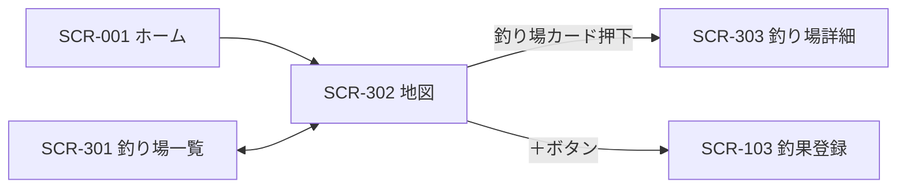

# SCR-302 地図画面

## 1. 基本情報
| 項目 | 内容 |
| --- | --- |
| 画面ID | SCR-302 |
| 画面名 | 地図画面 |
| URL・パス | `/map` |
| 概要（1行） | 釣り場を地図上に表示し、選択した釣り場の概要を画面下部のカードで確認する |
| 対象ユーザー・権限 | 全ユーザー（権限による出し分けは保留 → [README.md](./README.md) の「権限の扱い」） |
| 関連画面 | SCR-001 ホーム画面 / SCR-002 検索画面 / SCR-003 お気に入り画面 / SCR-101 釣果一覧画面 / SCR-103 釣果登録画面 / SCR-301 釣り場一覧画面 / SCR-303 釣り場詳細画面 |
| ステータス | 下書き |
| デザインカンプ | [Figma: セリオ釣りMAP ＞ map（node-id=1158-2110）](https://www.figma.com/design/LgJDTLLmkMfjeamo0zQl2b/%E3%82%BB%E3%83%AA%E3%82%AA%E9%87%A3%E3%82%8AMAP?node-id=1158-2110) |

## 2. 画面概要
釣り場を地図上に表示する画面です。
グローバルナビの「map」に対応し、地図から目的の釣り場を探す用途を担います。
地図上で釣り場を選ぶと、画面下部にその釣り場の概要（写真・名称・釣れる魚種）がカードで表示され、詳細画面への入口になります。
サイドバー上部の「＋」から、釣果の登録へ直接進めます。

## 3. 画面レイアウト
**レイアウトの正典は Figma**。この設計書には対象フレームの URL を必ず記載する（「1. 基本情報＞デザインカンプ」と一致させる）。
見た目の詳細は Figma を参照し、ここでは URL とレスポンシブ方針・補足のみを扱う。

- **Figma フレーム URL**: https://www.figma.com/design/LgJDTLLmkMfjeamo0zQl2b/%E3%82%BB%E3%83%AA%E3%82%AA%E9%87%A3%E3%82%8AMAP?node-id=1158-2110
- **レスポンシブ方針（PC）**: 左に固定幅のサイドバー（Navigation Rail）、右に可変幅のメインコンテンツ（地図）を置く2カラム構成。釣り場カードはメインコンテンツ下部に重ねて表示する。
- **レスポンシブ方針（SP）**: （記入）— Navigation Rail に「押すと広がる」と注記があり、ハンバーガー押下で展開する想定。狭幅時の釣り場カードの扱いは要確認（「8. 備考・課題」参照）。

簡易ワイヤー（詳細は Figma が正典）:

```
+---+--------------------------------------+
| ≡ |                                      |
|   |                                      |
| ＋|                                      |
|   |           （地図：全面表示）         |
| ● |                                      |
|map|                                      |
| ○ |                                      |
|一覧|                                      |
| ○ |   +------------------------------+   |
|検索|   |[写真] 宇野港          ◇   ◇ |   |
| ○ |   |       チヌ、アジ             |   |
|お気|   +------------------------------+   |
+---+--------------------------------------+
  ↑ サイドバー          ↑ 釣り場カード（地図に重ねて表示）
    ● = 選択中（背景色付きの角丸で現在地を示す）
    ◇ = アイコンボタン（Figma 上はテンプレの再生コントロールのままで用途未確定）
```

> 画面項目（4.）・状態（6.）のテキストは Figma フレーム（node-id=1158-2110）から起こしています。

## 4. 画面項目
モックから読み取れる要素のみを記載しています。モックに情報がない箇所は `（記入）` を残しています。

| No | 項目名 | 種別 | 必須 | 説明・制約（桁数 / 形式 / 初期値 など） |
| --- | --- | --- | --- | --- |
| 1 | メニュー開閉ボタン（ハンバーガー） | ボタン | − | サイドバー上部に配置。押下時の挙動は要確認（サイドバーの折りたたみ／SP でのドロワー開閉） |
| 2 | 釣果登録ボタン（＋） | ボタン | − | サイドバー上部、ナビ項目とは別枠。背景色付きの角丸で強調表示。全ユーザーに表示（保留: 会員のみ） |
| 3 | ナビ項目「map」 | リンク | − | アイコン＋ラベル。本画面が現在地のため選択中（背景色付き） |
| 4 | ナビ項目「一覧」 | リンク | − | アイコン＋ラベル |
| 5 | ナビ項目「検索」 | リンク | − | アイコン＋ラベル |
| 6 | ナビ項目「お気に入り」 | リンク | − | アイコン＋ラベル。遷移先は SCR-003 お気に入り画面。**機能自体が保留**（[docs/tasks.md](../tasks.md) の T-38） |
| 7 | 地図 | 地図 | − | メインコンテンツ全面に表示。Figma では地図が画像（`image 1` / `image 2`）で表現されており、初期表示位置・ズーム倍率・釣り場のピン表現はすべて（記入） |
| 8 | 釣り場カード | その他 | − | 地図下部に重ねて表示するカード。Figma 上は Material の `Compact media player` を流用している。表示される契機（ピン選択時のみか、常時か）は要確認 |
| 9 | 釣り場サムネイル | 画像 | − | カード左端。Figma 上は `Image` フレーム。画像が無い場合の代替表示は（記入） |
| 10 | 釣り場名 | ラベル | ○ | Figma の表示は「宇野港」（レイヤー名も `釣り場名称` にリネーム済み）。桁数・省略表示（末尾省略）の要否は（記入） |
| 11 | 釣れる魚種 | ラベル | − | Figma の表示は「チヌ、アジ」。読点区切り。表示件数の上限・並び順は（記入） |
| 12 | カード内アイコンボタン1 | ボタン | − | カード右側（Figma 上は `Playback controls > Icon button 1`）。お気に入り登録・解除と推測されるが、アイコンがプレースホルダのため**用途は未確定**。お気に入り機能自体も保留（T-38） |
| 13 | カード内アイコンボタン2 | ボタン | − | カード右端（同 `Icon button 2`）。用途は（記入） |

> 項目 12・13 は Figma 上では Material の再生コントロール（`Playback controls`）の流用で、アイコンが差し替えられていません。用途の確定が必要です（「8. 備考・課題」の課題9参照）。

## 5. アクション / イベント
ナビの遷移先は、既存の画面一覧に当てはめた**仮案**です（「8. 備考・課題」の課題1・2参照）。

| 操作（トリガー） | 挙動（処理内容） | 遷移先・結果 |
| --- | --- | --- |
| ハンバーガー押下 | サイドバーの表示／非表示を切り替える（挙動は要確認） | 同画面でサイドバーの表示状態が変わる |
| 「＋」ボタン押下 | 釣果の新規登録へ進む | SCR-103 釣果登録画面へ遷移（仮）。条件なし（保留: 会員のみ） |
| ナビ「一覧」押下 | 一覧画面へ遷移 | SCR-101 釣果一覧画面へ遷移（仮） |
| ナビ「検索」押下 | 検索画面へ遷移 | SCR-002 検索画面へ遷移（仮） |
| ナビ「お気に入り」押下 | お気に入り画面へ遷移 | SCR-003 お気に入り画面へ遷移。**機能自体が保留**（T-38） |
| 地図上の釣り場（ピン）押下 | 当該釣り場の情報を画面下部のカードに表示する | 同画面でカードの内容が切り替わる |
| 地図のドラッグ・ズーム操作 | 表示範囲を変更する。範囲変更時に釣り場を再取得するかは要確認 | 同画面で地図の表示範囲が変わる |
| 釣り場カード押下 | 当該釣り場の詳細へ進む | SCR-303 釣り場詳細画面へ遷移（仮） |
| カード内アイコンボタン1 押下 | （記入）— お気に入り登録・解除と推測されるが Figma に根拠がない（課題9） | （記入） |
| カード内アイコンボタン2 押下 | （記入）— 用途未確定（課題9） | （記入） |

## 6. 表示・状態
表示条件と、状態ごとの見せ方を記入する。該当しない状態の行は削除してよい。

| 状態 | 表示条件 | 表示内容 |
| --- | --- | --- |
| 通常 | 画面表示時 | サイドバー（＋ボタン、ナビ4項目）と地図を表示する。ナビ「map」は背景色付きの角丸で現在地を示す |
| 通常（釣り場選択中） | 地図上の釣り場を選択したとき | 画面下部に釣り場カード（写真・名称・魚種・アイコンボタン2つ）を表示する |
| ローディング | 地図・釣り場データの取得中 | （記入） |
| データ空（Empty） | 表示範囲内に釣り場が 0 件 | （記入）— カードを出さずに地図のみ表示するのか、案内文を出すのか要確認 |
| エラー | 取得・通信失敗 | （記入） |
| 権限なし | — | **保留**（ログイン機能を実装しないため当面は発生しない → [README.md](./README.md) の「権限の扱い」） |

## 7. 画面遷移
- **遷移元**: SCR-001 ホーム画面 / SCR-301 釣り場一覧画面（一覧 ⇄ 地図 の表示切替）
- **遷移先**: SCR-303 釣り場詳細画面 / SCR-103 釣果登録画面（仮）/ SCR-101 釣果一覧画面（仮）/ SCR-002 検索画面（仮）



全体の遷移は [screen-transition.md](./screen-transition.md) を参照してください。

## 8. 備考・課題
本設計書は当初ブラウザモック画像1枚から起こしたものですが、2026-08-31 に Figma フレーム（node-id=1158-2110）の内容を反映しました。地図そのものが画像で表現されているため、地図まわりは未確定のまま残っています。

1. ~~**ナビ4項目目が [SCR-001](./SCR-001-home.md) のモックと食い違う**~~ — **解消**。Figma の `version2.0` 全12フレームを確認したところ、正は `map` / `一覧` / `検索` / `お気に入り` ＋ FAB でした（本設計書の記述が正しかった）。SCR-001 側の `入力` は `version1.0` の Navigation Rail が消し忘れで重なっていたものです。SCR-001 の記述は揃えました。
2. ~~**「お気に入り」の遷移先画面が未定義**~~ — **解消**。SCR-003 お気に入り画面として採番しました（[screen-list.md](./screen-list.md)）。ただし Figma にフレームは無く、機能自体も T-38 で保留中です。
3. **ナビ項目と画面一覧の対応が暫定** — `一覧`→SCR-101 釣果一覧、`検索`→SCR-002 検索、`FAB`→SCR-103 釣果登録 というマッピングは仮案のままです。Figma キャンバスの矢印はホーム画面からのものだけで、共通サイドバーの遷移先は明示されていません。`一覧` が釣果一覧なのか釣り場一覧（SCR-301）なのかは特に要確認。
4. **地図の仕様が未定** — 使用する地図サービス、初期表示の中心座標・ズーム倍率、釣り場のピン表現、表示範囲変更時の再取得有無がすべて未確定です。Figma 上も地図は画像（`image 1` / `image 2`）で置かれているだけです。
5. **釣り場カードの表示契機が未定** — 常時1件表示なのか、地図上のピンを選択したときのみ表示なのか、複数件を横スクロールで並べるのかが読み取れません。
6. **アイコンがすべてプレースホルダ** — 各ナビ項目の最終アイコンが未定。
7. ~~**Figma フレーム URL が未提供**~~ — **解消**。「1. 基本情報」「3. 画面レイアウト」の両方に反映しました。
8. **SP レイアウトが未定** — Navigation Rail の共通コンポーネントに「押すと広がる」と注記がありハンバーガーの挙動は判明しましたが、狭幅時の釣り場カードの扱いは未確定です。
9. **釣り場カードが Material テンプレの流用** — カードは `Compact media player`（音楽プレイヤー）、右側の2つのボタンは `Playback controls` の再生コントロールをそのまま使っており、アイコンが差し替えられていません。当初「☆（お気に入り）」「⋮（その他メニュー）」と読み取っていましたが、**Figma 上にその根拠はなく用途は未確定**です。
10. **Material テンプレの残骸** — Navigation Rail の `Nav item 5` 〜 `7` が非表示のまま残っています。

---

### 更新履歴
| 日付 | 版 | 変更内容 | 担当 |
| --- | --- | --- | --- |
| 2026-08-13 | 0.1 | 新規作成（モック画像から起こした骨子） | （記入） |
| 2026-08-31 | 0.2 | Figma フレーム（node-id=1158-2110）から項目表を反映。課題1・2・7 を解消し、釣り場カードがテンプレ流用である旨を課題9 に追加 | （記入） |
| 2026-08-31 | 0.3 | Figma REST API（スキル `figma-sync`）で全フレームを再取得し、本設計書の記述と**差分なし**を確認。「3. 画面レイアウト」の Figma 取得に関する注記を [README.md](./README.md) の記述に合わせた | （記入） |
