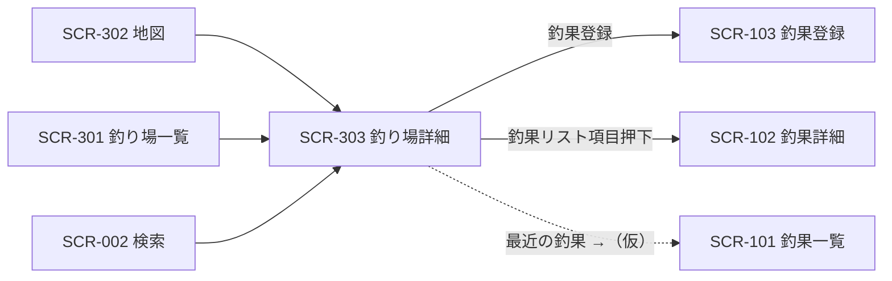

# SCR-303 釣り場詳細画面

## 1. 基本情報
| 項目 | 内容 |
| --- | --- |
| 画面ID | SCR-303 |
| 画面名 | 釣り場詳細画面 |
| URL・パス | `/spots/:id` |
| 概要（1行） | 釣り場1件の詳細（写真・説明・最近の釣果）を表示し、この釣り場での釣果登録へ進む |
| 対象ユーザー・権限 | 全ユーザー（権限による出し分けは保留 → [README.md](./README.md) の「権限の扱い」） |
| 関連画面 | SCR-002 検索画面 / SCR-003 お気に入り画面 / SCR-101 釣果一覧画面 / SCR-102 釣果詳細画面 / SCR-103 釣果登録画面 / SCR-202 魚詳細画面 / SCR-301 釣り場一覧画面 / SCR-302 地図画面 |
| ステータス | 下書き |
| デザインカンプ | [Figma: セリオ釣りMAP ＞ map詳細（node-id=1159-3258）](https://www.figma.com/design/LgJDTLLmkMfjeamo0zQl2b/%E3%82%BB%E3%83%AA%E3%82%AA%E9%87%A3%E3%82%8AMAP?node-id=1159-3258) |

> Figma 上のフレーム名は「map詳細」です。本画面（釣り場詳細）に対応すると判断した根拠は、キャンバス上の矢印 `釣り場一覧 --> map詳細` と、フレームの中身が釣り場名（「宇野港」）＋説明文＋「最近の釣果」で構成されていることです（課題17参照）。

## 2. 画面概要
釣り場1件の詳細を表示する画面です。
上部に釣り場の写真・名称・説明文と「釣果登録」ボタンを置き、下部に「最近の釣果」としてこの釣り場で登録された釣果を並べます。
地図・一覧・検索のいずれからも到達する、釣り場情報の集約先です。
ヘッダーの戻るリンクは遷移元を文言に含めており、モックでは「mapに戻る」と表示されています（課題1参照）。

## 3. 画面レイアウト
**レイアウトの正典は Figma**。この設計書には対象フレームの URL を必ず記載する（「1. 基本情報＞デザインカンプ」と一致させる）。
見た目の詳細は Figma を参照し、ここでは URL とレスポンシブ方針・補足のみを扱う。

- **Figma フレーム URL**: https://www.figma.com/design/LgJDTLLmkMfjeamo0zQl2b/%E3%82%BB%E3%83%AA%E3%82%AA%E9%87%A3%E3%82%8AMAP?node-id=1159-3258
- **レスポンシブ方針（PC）**: 左に固定幅のサイドバー（Navigation Rail）、右に可変幅のメインコンテンツを置く2カラム構成。メインコンテンツは上から Top app bar（戻るリンク・アクションアイコン2つ）、釣り場情報ブロック（左に写真、右に名称・説明・釣果登録ボタンの横並び2カラム）、「最近の釣果」セクション（縦積みのリスト3件）。
- **レスポンシブ方針（SP）**: （記入）— 釣り場情報ブロックを写真の上下積みに切り替える想定だが、Figma に情報がないため要確認。

簡易ワイヤー（詳細は Figma が正典）:

```
+---+--------------------------------------+
| ≡ | ← mapに戻る              ◇    ◇     |
|   | +----------+  宇野港 [編集]          |
| ＋| |          |  Published date         |
|   | |  写真    |  （説明文：2段落）      |
| ● | |          |                         |
|map| +----------+  [ 釣果登録 ]           |
| ○ |                                      |
|一覧| 最近の釣果 ◇                        |
| ○ | +----------------------------------+ |
|検索| |[写真] チヌ                        | |
| ○ | |       Description ...             | |
|お気| | ◇ Today・23 min              ◇  | |
|   | +----------------------------------+ |
|   | |[   ]  Title  （全3件）           | |
+---+--------------------------------------+
  ↑ サイドバー
    ● = 背景色付きの角丸（Figma では「map」に付いている。課題2参照）
    ◇ = アイコン（Figma 上はプレースホルダのため用途未確定）
```

> 画面項目（4.）・状態（6.）のテキストは Figma フレーム（node-id=1159-3258）から起こしています。

## 4. 画面項目
モックから読み取れる要素のみを記載しています。モックがダミー値（`Published date` / `Lorem ipsum ...` / `Description ...` / `Today・23 min` / `Title`）の箇所は `（記入）` を残しています。

| No | 項目名 | 種別 | 必須 | 説明・制約（桁数 / 形式 / 初期値 など） |
| --- | --- | --- | --- | --- |
| 1 | メニュー開閉ボタン（ハンバーガー） | ボタン | − | サイドバー上部に配置。押下時の挙動は要確認（サイドバーの折りたたみ／SP でのドロワー開閉） |
| 2 | 釣果登録ボタン（＋、サイドバー） | ボタン | − | サイドバー上部、ナビ項目とは別枠。本文中の「釣果登録」ボタン（No.10）と導線が重複（課題3参照） |
| 3 | ナビ項目「map」/「一覧」/「検索」/「お気に入り」 | リンク | − | アイコン＋ラベルの4項目。本画面はナビ直結ではないため、いずれも現在地にはならない想定 |
| 4 | 戻るリンク（← ＋ 文言） | リンク | − | Top app bar 左。Figma の表示は「mapに戻る」。**遷移元に応じて文言が変わるか固定かが未定**（課題1参照） |
| 5 | ヘッダーアクション1 | ボタン | − | Top app bar 右（`trailing-icon 1`）。アイコンがプレースホルダで**用途が不明**。お気に入り登録と推測されるが Figma に根拠なし（課題4参照）。お気に入り機能自体も保留（[docs/tasks.md](../tasks.md) の T-38） |
| 6 | ヘッダーアクション2 | ボタン | − | Top app bar 右端（`trailing-icon 3`。`trailing-icon 2` は非表示）。同上（課題4参照） |
| 7 | 釣り場写真 | 画像 | − | 釣り場情報ブロック左側（`Header > Image`）。1枚。複数枚を扱うか（カルーセル等）、画像が無い場合の代替表示は（記入）（課題5参照） |
| 8 | 釣り場名 | ラベル | ○ | Figma の表示は「宇野港」。桁数・省略表示の要否は（記入） |
| 9 | 編集アイコン | ボタン | − | 釣り場名の右（Figma 上は `edit` という**中身が空のフレーム**）。釣り場情報の編集導線と推測されるが、対応する編集画面が [screen-list.md](./screen-list.md) に無い（課題18参照） |
| 10 | 説明文の見出し | ラベル | − | Figma の表示は `Published date`（ダミー・英語）。**釣り場に「公開日」を出す意味が読み取れず、表示すべき内容が未確定**（課題6参照） |
| 11 | 釣り場の説明文 | ラベル | − | Figma は Lorem ipsum の2段落。文字数上限・段落数・改行の扱い・折りたたみ（「続きを読む」）の要否は（記入） |
| 12 | 「釣果登録」ボタン | ボタン | − | 塗りボタン（`Header > Text column > Button`）。当該釣り場に紐づけて釣果を登録する想定。条件なし（保留: 会員のみ）。サイドバーの「＋」との使い分けは課題3参照 |
| 13 | 「最近の釣果」セクション見出し | ラベル | − | Figma の表示は「最近の釣果」 |
| 14 | セクション見出し横のアイコンボタン | ボタン | − | 見出し右（`Title header > Icon button`）。アイコンがプレースホルダで**用途が不明**。一覧への「もっと見る」導線と推測されるが Figma に根拠なし（課題7参照） |
| 15 | 釣果リスト項目 | その他 | − | 「最近の釣果」内の1件分（`column 01 > List item 01` 〜 `03`）。Figma は3件。項目全体が釣果詳細へのリンク。表示件数・並び順は（記入）（課題8参照） |
| 16 | 釣果のサムネイル | 画像 | − | リスト項目左側。画像が無い場合の代替表示は（記入） |
| 17 | 釣果のタイトル | ラベル | ○ | Figma の表示は1件目のみ「チヌ」、2・3件目は `Title`（ダミー）。魚種名か、釣果自体のタイトルかが（記入）（課題9参照） |
| 18 | 釣果の説明文 | ラベル | − | Figma の表示は `Description duis aute ...`（ダミー・英語）。表示内容・行数制限は（記入） |
| 19 | 釣果のメタ情報 | ラベル | − | Figma の表示は `Today`（Date）＋ `•`（Separator）＋ `23 min`（Time）。**「23 min」が何を指すか不明**（課題10参照） |
| 20 | リスト項目のアイコン（左） | ボタン | − | メタ情報の左（`Leading & Trailing icons > Leading > Icon`）。**用途が不明**（課題10参照） |
| 21 | リスト項目のアイコン（右） | ボタン | − | リスト項目右端（同 `Icon`）。**用途が不明**（課題10参照） |

## 5. アクション / イベント

| 操作（トリガー） | 挙動（処理内容） | 遷移先・結果 |
| --- | --- | --- |
| ハンバーガー押下 | サイドバーの表示／非表示を切り替える（挙動は要確認） | 同画面でサイドバーの表示状態が変わる |
| サイドバー「＋」押下 | 釣果の新規登録へ進む | SCR-103 釣果登録画面へ遷移（仮）。条件なし（保留: 会員のみ）。釣り場が引き継がれるかは課題3参照 |
| ナビ「map」/「一覧」/「検索」押下 | 各画面へ遷移 | SCR-302 地図画面 / SCR-201 魚一覧画面 / SCR-002 検索画面へ遷移 |
| ナビ「お気に入り」押下 | お気に入り画面へ遷移 | SCR-003 お気に入り画面へ遷移。**機能自体が保留**（T-38） |
| 戻るリンク押下 | 遷移元の画面へ戻る | 遷移元による（Figma では SCR-302 地図画面）。課題1参照 |
| ヘッダーアクション1 押下 | （記入：用途不明。お気に入り登録・解除と推測） | （記入）。**お気に入り機能自体が保留**（T-38） |
| ヘッダーアクション2 押下 | （記入：用途不明） | （記入） |
| 編集アイコン押下 | （記入：釣り場情報の編集と推測） | （記入：対応する編集画面が未定義。課題18参照） |
| 「釣果登録」ボタン押下 | 当該釣り場に紐づけて釣果を登録する | SCR-103 釣果登録画面へ遷移。条件なし（保留: 会員のみ）。釣り場を初期値として引き継ぐ想定 |
| セクション見出し横のアイコンボタン押下 | （記入：用途不明。当該釣り場の釣果一覧へ進む導線と推測） | （記入：SCR-101 釣果一覧画面を釣り場で絞り込んだ状態と推測。課題7参照） |
| 釣果リスト項目押下 | 当該の釣果の詳細へ進む | SCR-102 釣果詳細画面へ遷移 |
| リスト項目のアイコン（左 / 右）押下 | （記入：用途不明） | （記入） |

## 6. 表示・状態
表示条件と、状態ごとの見せ方を記入する。該当しない状態の行は削除してよい。

| 状態 | 表示条件 | 表示内容 |
| --- | --- | --- |
| 通常 | 当該釣り場が存在し、釣果が1件以上 | 釣り場情報ブロックと「最近の釣果」リストを表示する |
| データ空（Empty） | 当該釣り場の釣果が 0 件 | （記入）— 「最近の釣果」セクションごと非表示にするのか、「まだ釣果がありません」と出して釣果登録へ誘導するのか要確認 |
| ローディング | 釣り場・釣果データの取得中 | （記入） |
| エラー | 取得・通信失敗 | （記入）— 存在しない `:id` を指定された場合の扱い（404 表示など）も要確認 |
| 権限なし | — | **保留**（ログイン機能を実装しないため当面は発生しない → [README.md](./README.md) の「権限の扱い」） |

## 7. 画面遷移
- **遷移元**: SCR-302 地図画面（釣り場カード押下）/ SCR-301 釣り場一覧画面（釣り場カード押下）/ SCR-002 検索画面（検索結果カード押下）/ SCR-102 釣果詳細画面 / SCR-202 魚詳細画面
- **遷移先**: SCR-103 釣果登録画面（「釣果登録」ボタン・サイドバー「＋」）/ SCR-102 釣果詳細画面（釣果リスト項目）/ SCR-101 釣果一覧画面（「最近の釣果」の→、仮）



全体の遷移は [screen-transition.md](./screen-transition.md) を参照してください。

## 8. 備考・課題
本設計書はブラウザモック画像1枚から起こしたもので、説明文・釣果リストの中身がダミー値のため未確定の箇所が多く残っています。以下は仕様確定時に解消してください。

1. **戻るリンクの文言が遷移元依存** — モックは「mapに戻る」で、遷移元（地図画面）を文言に含めています。本画面は地図・一覧・検索・釣果詳細・魚詳細から到達しうるため、(a) 遷移元に応じて文言を動的に変えるのか、(b) 固定文言にするのか、(c) 直接 URL で開かれた場合に何を表示するのかが要確認です。なお [SCR-301](./SCR-301-spot-list.md) 課題4・[SCR-201](./SCR-201-fish-list.md) 課題5で「戻るボタンの戻り先が未定」としていた点に対し、本モックは「遷移元を文言に出す」方式を示しているため、全画面で方式を揃えるか要確認。
2. **ナビの選択中表示が「map」のまま** — 本画面はナビ直結ではないにもかかわらず、背景色付きの角丸が `map` に付いています。これで6画面目です。詳細画面など「ナビのどの項目にも対応しない画面」で現在地表示をどう扱うか（遷移元のナビ項目を選択中にする／どこも選択しない）を含めて仕様確定が必要です。
3. **釣果登録の導線が2つある** — サイドバーの「＋」と本文中の「釣果登録」ボタンです。本文側は当該釣り場を初期値として引き継ぐ想定ですが、サイドバー側が釣り場を引き継ぐのか空で始まるのかが未定です。両者の使い分けを明示する必要があります。
4. **ヘッダーアクション2つの用途が不明** — Figma 上は Material の Top app bar の `trailing-icon 1` と `3`（`2` は非表示）がそのまま残っており、アイコンも差し替えられていません。当初モック画像から「ブックマーク（🔖）」「⋮」と読み取っていましたが、**Figma 上にその根拠はありません**。お気に入り登録がここに入るのかを含めて用途の定義が必要です。あわせてグローバルナビの「お気に入り」（SCR-003）との関係（ここで登録したものがそこに並ぶのか）も未整理です。
5. **釣り場写真が1枚のみ** — 複数枚の写真を扱うか（カルーセル・サムネイル一覧）、写真が無い釣り場の代替表示が未定です。
6. **説明文の見出しが `Published date`** — 釣り場に「公開日」を出す意味が読み取れません。Material のテンプレートの既定要素が残っているだけの可能性があります。この位置に何を表示するか（登録日／最終更新日／削除して説明文のみにする）を確定させる必要があります。
7. **セクション見出し横のアイコンボタンの用途が未定** — Figma 上は `Icon button` というプレースホルダで、当初「もっと見る（→）」と読み取っていましたが**根拠はありません**。[SCR-101 釣果一覧画面](./SCR-101-catch-list.md) を釣り場で絞り込んだ状態への導線と推測しますが、[SCR-301](./SCR-301-spot-list.md) 課題2で挙げた「条件付き一覧」と同じ論点で、URL に条件を持たせるか（`/catches?spot=...`）を含めて要確認です。
8. **「最近の釣果」の件数制御が未定** — Figma は3件（`List item 01` 〜 `03`）です。これが表示件数の仕様なのかは不明で、並び順（新着順）、ページング・追加読み込みの有無も未確定です。
9. **釣果リスト項目のタイトルが魚種名になっている** — Figma の表示は1件目が「チヌ」、2・3件目は `Title`（ダミー）です。釣果自体のタイトルなのか魚種名なのかが不明で、魚種名なら [SCR-202 魚詳細画面](./SCR-202-fish-detail.md) へのリンクにするかも要確認です。
10. **釣果リスト項目のメタ情報とアイコンが不明** — `Today`（Date）・`•`（Separator）・`23 min`（Time）という構成で、「23 min」が何を指すか読み取れません。左右のアイコンも `Icon` というプレースホルダのままです。**Material の動画・音声リスト用コンポーネントの既定要素が残っている**ことが Figma のレイヤー構造から確認できました。釣果に必要な情報（釣れた日時・釣り人・サイズなど）に置き換える必要があります。
11. **地図表示・アクセス情報が無い** — [CLAUDE.md](../../CLAUDE.md) のドメインモデルでは釣り場が「地図表示・アクセス情報」を持つとされ、[screen-list.md](./screen-list.md) の概要も「釣り場1件の詳細（釣果・アクセスなど）」ですが、モックにはどちらもありません。詳細画面に地図やアクセス情報を載せるか要確認です。
12. **釣れる魚種の表示が無い** — [SCR-302 地図画面](./SCR-302-map.md) の釣り場カードには「チヌ、アジ」と魚種が出ていましたが、詳細画面には表示されていません。カードより詳細画面の情報が少ないことになるため要確認。
13. **説明文が英語のダミー** — Lorem ipsum・`Description ...`・`Today` / `23 min` はすべて英語のダミーです。日本語での表示文言の確定が必要です。
14. **アイコンがすべてプレースホルダ** — 各ナビ項目の最終アイコンが未定。
15. ~~**Figma フレーム URL が未提供**~~ — **解消**。「1. 基本情報」「3. 画面レイアウト」の両方に反映しました。
16. **SP レイアウトが未定** — 釣り場情報ブロックの2カラムを縦積みに切り替える基準は未確定です。ハンバーガーの挙動は共通コンポーネントの注記「押すと広がる」で判明しました。
17. **Figma のフレーム名が「map詳細」** — 本画面（釣り場詳細）に対応すると判断しましたが、フレーム名は「map詳細」で SCR-302 地図画面の詳細版とも読めます。根拠はキャンバス上の矢印 `釣り場一覧 --> map詳細` と、中身が釣り場名＋説明文＋最近の釣果である点です。**Figma 側のフレーム名を「釣り場詳細」に改めることを推奨**します。
18. **編集導線に対応する画面が無い** — 釣り場名の右に `edit` というフレーム（中身は空）が置かれています。釣り場情報の編集画面が [screen-list.md](./screen-list.md) に定義されていません。編集機能を設けるか、設けるなら採番が必要です。なお v1 キャンバスには「自分が追加した魚情報は魚詳細から消せるようにしたい」という注釈があり、マスタの編集・削除に関する要求が存在します。
19. **釣果詳細（SCR-102）・魚詳細（SCR-202）とテキストがほぼ同一** — 3画面とも `mapに戻る` / `宇野港` / `Published date` / Lorem ipsum / `最近の釣果` / `チヌ` という同じテンプレートから複製されており、各画面固有の作り込みが未了です。SCR-102 には「魚種、釣れた匹、天気、最大サイズ」「直近の釣り場」という固有テキストが追加されています。
20. **Content が二重に配置されている** — 本フレームにはメインコンテンツ（`Content`）が2つ重なっています。表示上の差は出ませんが、Figma 側の整理が必要です。

---

### 更新履歴
| 日付 | 版 | 変更内容 | 担当 |
| --- | --- | --- | --- |
| 2026-08-14 | 0.1 | 新規作成（モック画像から起こした骨子） | （記入） |
| 2026-08-31 | 0.2 | Figma フレーム（node-id=1159-3258）から項目表を反映。課題15 を解消し、ヘッダー・リスト項目のアイコンがテンプレ既定のままである旨を課題4・7・10 に反映。編集導線（課題18）・フレーム名（課題17）・Content 二重配置（課題20）を追加 | （記入） |
| 2026-08-31 | 0.3 | Figma REST API（スキル `figma-sync`）で全フレームを再取得し、本設計書の記述と**差分なし**を確認。「3. 画面レイアウト」の Figma 取得に関する注記を [README.md](./README.md) の記述に合わせた | （記入） |
