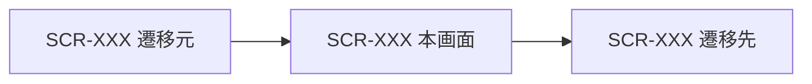

<!--
  画面設計書テンプレート — このファイルをコピーして「1 画面 1 ファイル」で作成してください。
  ・ファイル名: SCR-XXX-<画面名>.md（例: SCR-101-map.md）
  ・「（記入）」を実際の内容に置き換える
  ・使わない任意セクション（7. メッセージ / 8. データ・API連携）は削除して構いません
  ・語彙（種別・ステータス・状態）は ./README.md の「記法の凡例」に統一する
  ・作成後はこのコメントブロックを削除してください
-->

# SCR-XXX ＜画面名＞

## 1. 基本情報
| 項目 | 内容 |
| --- | --- |
| 画面ID | SCR-XXX |
| 画面名 | （記入） |
| URL・パス | `/（記入）` |
| 概要（1行） | （記入） |
| 対象ユーザー・権限 | 全ユーザー（権限による出し分けは保留 → [README.md](./README.md) の「権限の扱い」） |
| 関連画面 | （記入：SCR-XXX ＜画面名＞ …） |
| ステータス | 下書き |
| デザインカンプ | （記入：Figma 等の URL） |

## 2. 画面概要
（この画面の目的・役割・主な利用シーンを 2〜4 行で記入）

## 3. 画面レイアウト
**レイアウトの正典は Figma**。この設計書には対象フレームの URL を必ず記載する（「1. 基本情報＞デザインカンプ」と一致させる）。
見た目の詳細は Figma を参照し、ここでは URL とレスポンシブ方針・補足のみを扱う。

- **Figma フレーム URL**: （記入：対象画面のフレーム/ページへの直リンク）
- **レスポンシブ方針（PC）**: （記入）
- **レスポンシブ方針（SP）**: （記入）

<!-- 任意: 方針理解のための簡易ワイヤー（詳細は Figma が正典）。不要なら削除。
```
+------------------------------------------+
| ヘッダー                                 |
+------------------------------------------+
| （メインコンテンツの概略）               |
+------------------------------------------+
| フッター                                 |
+------------------------------------------+
```
-->

> 画面項目（4.）・状態（6.）などのテキストは Figma フレームから起こす。手順は [README.md](./README.md) の「Figma からテキストを起こす手順」、実行手段はスキル [figma-sync](../../.claude/skills/figma-sync/SKILL.md)。起こしたら `> 画面項目（4.）・状態（6.）のテキストは Figma フレーム（node-id=…）から起こしています。` の形に書き換える。

## 4. 画面項目
| No | 項目名 | 種別 | 必須 | 説明・制約（桁数 / 形式 / 初期値 など） |
| --- | --- | --- | --- | --- |
| 1 | （記入） | テキスト入力 | ○ | （記入） |
| 2 | （記入） | ボタン | − | （記入） |

## 5. アクション / イベント
| 操作（トリガー） | 挙動（処理内容） | 遷移先・結果 |
| --- | --- | --- |
| （例）「検索」ボタン押下 | （記入） | （記入：SCR-XXX へ遷移 / 同画面で結果表示 など） |

## 6. 表示・状態
表示条件と、状態ごとの見せ方を記入する。該当しない状態の行は削除してよい。

| 状態 | 表示条件 | 表示内容 |
| --- | --- | --- |
| 通常 | （記入） | （記入） |
| ローディング | データ取得中 | （記入） |
| データ空（Empty） | 該当データ 0 件 | （記入） |
| エラー | 取得・通信失敗 | （記入） |
| 権限なし | — | **保留**（ログイン機能を実装しないため当面は発生しない → [README.md](./README.md) の「権限の扱い」） |

## 7. メッセージ（任意）
| 種別 | 文言 | 表示契機 |
| --- | --- | --- |
| 確認 | （記入） | （記入） |
| エラー | （記入） | （記入） |

## 8. データ・API連携（任意）
| 用途 | エンドポイント・データ | 参照/更新 |
| --- | --- | --- |
| （例）スポット一覧取得 | `GET /api/（記入）` | 参照 |

## 9. 画面遷移
- **遷移元**: （記入：SCR-XXX ＜画面名＞ …）
- **遷移先**: （記入：SCR-XXX ＜画面名＞ …）



## 10. 備考・課題
- （記入：オープン事項 / TODO / 検討中の仕様 など）

---

### 更新履歴（任意）
| 日付 | 版 | 変更内容 | 担当 |
| --- | --- | --- | --- |
| YYYY-MM-DD | 0.1 | 新規作成 | （記入） |
