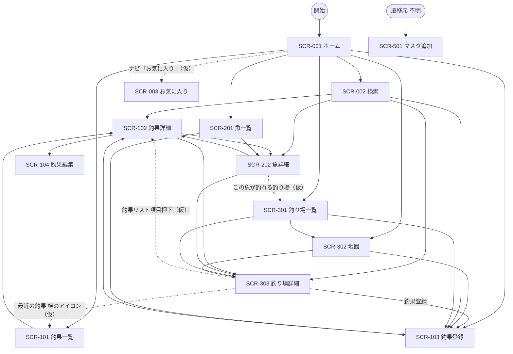

# 画面遷移図（釣りマップ）

アプリ全体の画面遷移を Mermaid で表します。ノードは画面ID、矢印は遷移（親→子）です。
画面を追加したらノードと矢印を追記してください。画面IDは [screen-list.md](./screen-list.md) と一致させます。

> URL・トリガーは現時点の**仮案**です。仕様確定時に更新してください。
> **権限による分岐は当面ありません**（ログイン機能は保留 → [README.md](./README.md) の「権限の扱い」）。以下の条件表に残る権限の記述は再検討時の参照用です。
> **釣行（SCR-4xx）のノードはありません** — 釣行は画面を持たないドメイン概念です（[screen-list.md](./screen-list.md) の「釣行（SCR-4xx）— 欠番」参照）。

実線のうち以下は **Figma キャンバス上の矢印**を根拠としています（`version2.0` 領域）。それ以外はモックからの推測です。

```
ホーム画面 → 入力フォーム / 検索 / map / 釣り場一覧 / 魚一覧表示 / 釣果一覧
map → map詳細 ／ 魚一覧表示 → 魚詳細 ／ 釣り場一覧 → map詳細
検索 → 魚詳細 / map詳細 / 釣果詳細 ／ 釣果一覧 → 釣果詳細
```

> **マスタ追加画面（SCR-501）へ向かう矢印は Figma に1本もありません。**遷移元が不明のため、下図では孤立ノードとして点線で表記しています（[SCR-501](./SCR-501-master-add.md) の課題2）。

## 全体遷移図


> ノードIDにはハイフンが使えないため `SCR_001` のようにアンダースコアを使い、表示名（ラベル）に `SCR-001` を書きます。

## 凡例
| 表記 | 意味 |
| --- | --- |
| `["SCR-XXX 画面名"]` | 通常画面 |
| `(["…不明"])` | 遷移元・遷移先が特定できていないことを表すプレースホルダ（画面ではない） |
| `((開始))` | 開始 / エントリーポイント |
| `-->` | 遷移（親→子） |
| `-->|ラベル|` | 遷移（ラベルはトリガー操作） |
| `-.->` | 遷移（**仮説**。モックからの推測で未確定のもの） |
| `%% コメント` | 図中コメント（描画されない） |

## 遷移条件の補足
矢印だけでは表せない条件（権限・状態による分岐など）を記載します。（内容は仮案）

| 遷移元 | 遷移先 | トリガー | 条件・補足 |
| --- | --- | --- | --- |
| SCR-001 ホーム | SCR-103 釣果登録 | 「釣果を登録する」ボタン / サイドバーの FAB | 条件なし（保留: 会員のみ・未ログイン時はログインへ誘導）。Figma の矢印 `ホーム画面 --> 入力フォーム` を根拠とする。2つの導線の使い分けは未整理（[SCR-001](./SCR-001-home.md) 課題5） |
| SCR-102 釣果詳細 | SCR-104 釣果編集 | 「編集」 | 条件なし（保留: 投稿者本人のみ）。SCR-104 は Figma にフレームが無く**デザイン未着手** |
| SCR-301 釣り場一覧 | SCR-302 地図 | 表示切替 | 一覧 ⇄ 地図 の表示切替（相互遷移）。切替 UI が Figma に見当たらない（[SCR-301](./SCR-301-spot-list.md) 課題6） |
| SCR-001 ホーム | SCR-302 / SCR-101 / SCR-002 / SCR-003 | グローバルナビ「map」「一覧」「検索」「お気に入り」 | ナビ4項目を既存画面に当てた**暫定マッピング**。Figma にはホーム画面から `釣果一覧` `釣り場一覧` `魚一覧表示` の3本の矢印があり、ナビ「一覧」がどれに対応するかは未確定（[SCR-001](./SCR-001-home.md) 課題1） |
| **全画面共通**（サイドバー） | SCR-302 / SCR-201 / SCR-002 | グローバルナビ「map」「一覧」「検索」 | モックの注目枠から読み取った対応（`map`→SCR-302、`一覧`→**SCR-201 魚一覧**、`検索`→SCR-002）。**推測であり未確定**（[SCR-201](./SCR-201-fish-list.md) の「8. 備考・課題」課題1参照）。SCR-301 釣り場一覧にはナビ直結の導線が無い可能性がある |
| SCR-302 地図 | SCR-303 釣り場詳細 | 釣り場カード押下 | 地図上の釣り場を選択すると画面下部にカードが出る。カード押下で詳細へ（仮案） |
| SCR-002 検索 | SCR-102 / SCR-202 / SCR-303 | 検索結果カード押下 | 結果はカテゴリ別（魚・釣り場など）にグルーピングされ、カードの属するカテゴリの詳細画面へ遷移する |
| SCR-301 釣り場一覧 | SCR-303 釣り場詳細 | 釣り場カード押下 | カードのグリッドから詳細へ |
| SCR-201 魚一覧 | SCR-202 魚詳細 | 魚カード押下 | カードのグリッドから詳細へ。レイアウトは SCR-301 とほぼ同一（[SCR-201](./SCR-201-fish-list.md) 課題2） |
| SCR-303 釣り場詳細 | SCR-103 釣果登録 | 本文中の「釣果登録」ボタン | 当該釣り場を初期値として引き継ぐ想定（保留: 会員のみ）。サイドバーの FAB との使い分けは未整理（[SCR-303](./SCR-303-spot-detail.md) 課題3） |
| SCR-303 釣り場詳細 | SCR-102 釣果詳細 | 「最近の釣果」のリスト項目押下 | 当該釣り場で登録された釣果の詳細へ。**仮説**（Figma にリンク設定の根拠がない）。図では点線で表記 |
| SCR-303 釣り場詳細 | SCR-101 釣果一覧 | 「最近の釣果」見出し横のアイコンボタン | **仮説**。Figma 上はアイコンがプレースホルダで用途未確定。釣り場で絞り込んだ釣果一覧と推測。図では点線で表記（[SCR-303](./SCR-303-spot-detail.md) 課題7参照） |
| SCR-302 / SCR-301 / SCR-002 → SCR-303 | — | 戻るリンク | SCR-303 の戻るリンクは遷移元を文言に含める（モックは「mapに戻る」）。動的に変えるか固定かは未確定（[SCR-303](./SCR-303-spot-detail.md) 課題1参照） |
| SCR-202 魚詳細 | SCR-301 釣り場一覧 | 「この魚が釣れる釣り場」（仮） | **仮説**。SCR-301 のモックのタイトルが「チヌが釣れる釣り場」で魚種による絞り込み状態のため推測。図では点線で表記（[SCR-301](./SCR-301-spot-list.md) の「8. 備考・課題」課題2参照） |
| **全画面共通**（サイドバー） | SCR-103 釣果登録 | サイドバーの FAB（＋ボタン） | 条件なし（保留: 会員のみ）。遷移先は仮案。図では設計書を起こした画面（SCR-302 / SCR-002 / SCR-301 / SCR-201）からの矢印のみ記載 |
| **全画面共通**（サイドバー） | SCR-003 お気に入り | グローバルナビ「お気に入り」 | Figma の `version2.0` 全12フレームでナビ4項目目は `お気に入り` に統一されている。ただし**遷移先のフレームは Figma に存在せずデザイン未着手**で、機能自体も [docs/tasks.md](../tasks.md) の T-38 で保留中。図では点線で表記 |
| SCR-101 釣果一覧 | SCR-102 釣果詳細 | 釣果カード押下 | カードのグリッドから詳細へ。Figma の矢印 `釣果一覧 --> 釣果詳細` を根拠とする。ただし SCR-101 のフレーム内タイトルは「宇野港で釣れる魚」で、この一覧が釣果のものか未確定（[SCR-101](./SCR-101-catch-list.md) 課題1） |
| SCR-202 魚詳細 | SCR-303 釣り場詳細 | 「直近の釣り場」のリスト項目押下 | Figma の魚詳細には「直近の釣り場」リスト（3件）が置かれており、釣り場詳細への導線と読める。**リンク設定の根拠は無く仮説**（[SCR-202](./SCR-202-fish-detail.md) 課題8） |
| SCR-102 釣果詳細 | SCR-303 釣り場詳細 | 「直近の釣り場」のリスト項目押下 | 同上。ただし**釣果1件の詳細に「直近の釣り場」リストが並ぶ理由が不明**で、魚詳細から複製されたまま残っている可能性がある（[SCR-102](./SCR-102-catch-detail.md) 課題2） |
| SCR-102 釣果詳細 ⇄ SCR-202 魚詳細 | — | — | 上図の `SCR_102 --> SCR_202` / `SCR_202 --> SCR_102` は**モック段階の推測で、Figma には根拠が見つかりませんでした**。両画面のリストはいずれも「直近の釣り場」で、相手の画面への導線がありません。削除するか、導線を Figma 側に追加するか要確認 |
| SCR-103 釣果登録 | SCR-102 釣果詳細 | 登録操作 | **仮説**。Figma の入力フォームには登録ボタン自体が存在せず、確定後の遷移先が未定（[SCR-103](./SCR-103-catch-register.md) 課題4） |
| （不明） | SCR-501 マスタ追加 | （不明） | **Figma のキャンバスに本フレームへ向かう矢印が1本もありません。**注釈の「未登録の魚などを自動的に追加していく」が正なら、画面としての導線ではなく SCR-103 釣果登録の一機能に吸収される可能性があります（[SCR-501](./SCR-501-master-add.md) 課題2）。図では孤立ノードとして点線で表記 |
